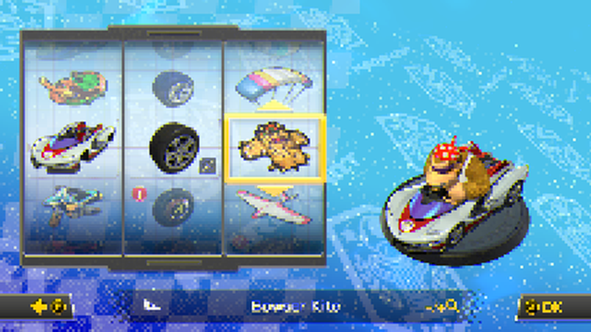

# switch-frame-tap

Building a Nintendo Switch → PC screen streamer that runs at **native
resolution and 60 fps**, and the research needed to get there. Homebrew,
developed on and for the author's own console.

> **There is a working, playable stream.** Live video from the console to a PC
> over USB at **768x432 / 59.6 fps**, through the Tegra VIC, into a one-process
> libusb + SDL2 viewer. 3600 frames with zero stale iterations. Low enough
> latency to play from the PC window.
>
> **It is still not a finished tool**, and the reason is now measured rather
> than estimated. The goal is native resolution at 60 fps, and **raw pixels
> cannot get there**: the USB 2.0 link saturates at **~37 MB/s**, which puts the
> 60 fps ceiling at about 800x450. Raw 1080p60 needs 186.6 MB/s even at 1.5
> bytes/pixel. The remaining work is **compression** (1080p60 H.264 all-intra at
> 50 Mbps is 6.25 MB/s — a sixth of what the cable already carries), or
> SuperSpeed. What is finished is finished properly and verified on hardware;
> what is not is marked as such throughout. See [Roadmap](#roadmap).

**Console under test:** Mariko, firmware **22.5.0**, Atmosphère **1.11.2**.
71 hardware test cycles.


*A real capture: read out of the game's swapchain by the sysmodule, de-swizzled
from Tegra block-linear on the PC. Native 1920x1080, docked.*



*A frame off the **live stream**: scaled and format-converted by the VIC on the
console, sent over USB at 1.5 bytes/pixel, reassembled by the viewer. No codec
and no colour matrix involved — see [packed 4:2:0](#the-vic-does-no-colour-conversion-and-that-turned-out-to-be-useful).*


## How this was built — with an AI, openly

I built this together with **Claude** (Anthropic's AI model, Opus 5, through
Claude Code). I want to be straightforward about that, because it should change
how you read and trust what's here.

- **Claude** wrote nearly all of the code and the documentation, did the
  source-reading (Atmosphère and its kernel mesosphere, libdrm, switchbrew),
  designed each hardware probe, and interpreted the logs that came back.
- **I** set the goal and the direction, ran every one of the 71 hardware tests
  on my own console, read the logs back off the SD card, decided which routes to
  keep pushing and when to drop one, and decided what to publish.

What that means for you:

- **"Verified on hardware" means exactly that** — a real run on a real console,
  with the log. Conclusions drawn from reading source rather than running it are
  labelled as such.
- **The AI got things wrong, and some mistakes were not cheap.** Since Claude
  wrote nearly all the code, the bugs are its bugs: including the ones that
  froze my console, one that fataled another sysmodule at boot, and a build
  (M33) that shipped without the NPDM flag it needed to work at all. Every one
  is recorded in [`tier4/mitm/STATUS.md`](tier4/mitm/STATUS.md). That log is
  written in the first person because Claude wrote it as the work happened.
- **The history shows it too.** Most commits carry a
  `Co-Authored-By: Claude` trailer.

Review it as you would a contribution from someone you haven't worked with
before — which is good advice for homebrew that drives hardware engines anyway.

---

## Why

[SysDVR](https://github.com/exelix11/SysDVR) streams the Switch screen to a PC,
capped at **720p30, game layer only**. That cap is not SysDVR's: it reads
`grc:d`, the game-recording encoder, whose configuration is fixed in firmware.

The obvious question is whether a sysmodule can do better by taking the frame
*before* the encoder — reading the game's own swapchain and running it through
the Tegra X1's own fixed-function blocks. This repository is the answer, worked
all the way down.

## Where the difficulty is

**A sysmodule can process frames at full speed. Getting hold of one is the
problem.**

Three independent routes to another process's pixels have each been taken to
the point of a definite verdict:

| route | verdict |
|---|---|
| Import the game's swapchain `nvmap` handle (`FROM_ID` + `MAP_CMD_BUFFER`) | Pins to `phys=0`, silently. Survives `is_compr`, `MAP_CMD_BUFFER_EX`, relocs, the full `0xFFFFFFFF` `nvdrv:t` permission mask, and the game's exact aruid adopted before any `Open`. **Structural:** at `Initialize` nvservices is handed `CUR_PROCESS_HANDLE` and maps client memory through *that*. The game's pages live in the game's process. |
| `vi` indirect layers (`GetIndirectLayerImageMap`) | `0x60A PreconditionViolation`. The whole object graph builds — `CreateIndirectLayer` → producer endpoint → consumer endpoint — and the layer is simply **empty**. Wiring an application's layer to an indirect layer is **AM's** job, and a sysmodule cannot drive AM. |
| Read back the display controller | **No such ioctl exists.** `nvdisp-disp0` is `FLIP` / `SET_MODE` / `GET_WINDOW`; `nvdcutil` is DSI/EDID test plumbing. Grepping all of nvdrv for `READBACK\|CAPTURE\|GET_FRAME\|SCANOUT` returns nothing. |

`caps` `CaptureRawImage`, the other obvious candidate, is `[1.0.0]` — removed
long before 22.5.0.

**This is very likely why SysDVR is stuck at 720p30.** It is not that nobody
tried; the platform does not let a sysmodule reach another process's
framebuffer through the graphics stack.

The one route that is *not* closed goes around the graphics stack entirely —
the kernel's debug SVCs. See [Where it stands](#where-it-stands).

## What is here that you might want

Several pieces are finished, verified on hardware, and — as far as I can tell —
not published anywhere else. They are useful on their own, whether or not the
capture problem is solved, so take any of them.

### 1. Non-domain mitm sub-object forwarding for libstratosphere

[`tier4/applet-mitm/patch_libstrat.py`](tier4/applet-mitm/patch_libstrat.py) —
55 lines, idempotent.

Atmosphère's mitm framework can forward commands it does not implement, but
only for objects on a **domain** session. `vi:u` hands out
`IApplicationDisplayService` and `IHOSBinderDriver` as sub-objects on a
**non-domain** session, and upstream libstratosphere has nowhere to put the
forward service for those — so every undeclared command on a wrapped sub-object
fails instead of passing through. The patch adds that path.

**If you have ever tried to mitm `vi` and given up, this is the missing piece.**

### 2. A transparent `vi:u` mitm that sees every frame

Wraps `GetDisplayService` → `IApplicationDisplayService` → `GetRelayService` →
`IHOSBinderDriver`, and intercepts `TransactParcelAuto`. Measured **60.0 fps
sustained**, invisible to the game.

From the binder traffic it recovers the exact layout of every frame:
`setPreallocatedBuffer` (code 14) carries a flattened `NvGraphicBuffer`, and
`queueBuffer` (code 7) names the swapchain slot — the latter behind Android's
`writeInterfaceToken`, which is parsed rather than guessed. For Mario Kart 8:
one nvmap object, 3 × 1920×1080 A8B8G8R8, block-linear kind `0xFE`,
`block_height_log2 = 4`, pitch 7680, slots at `0` / `0x870000` / `0x10E0000`.

### 3. A complete VIC pipeline driven from a sysmodule, byte-exact

The Video Image Compositor is the Tegra block that converts block-linear to
linear, scales, and changes pixel format — no GPU involved.
[`applet_mitm_nv.cpp`](tier4/applet-mitm/source/applet_mitm_nv.cpp) +
[`vic40_config.hpp`](tier4/applet-mitm/source/vic40_config.hpp) drive it end to
end over raw `nvdrv` ioctls:

```
heap alloc -> svcSetMemoryAttribute(Uncached) -> nvmap CREATE/ALLOC
  -> MAP_CMD_BUFFER pin -> host1x cmdbuf (SETCL + methods + INCR_SYNCPT)
  -> CHANNEL_SUBMIT -> syncpoint wait -> cache invalidate -> read back
```

A fill and a real blit both reproduce their expected output **byte for byte**.
Output byte order is A,R,G,B (`AV_PIX_FMT_ARGB`). NVENC
(`/dev/nvhost-msenc`) opens too, so the rest of a GPU-free encode pipeline is
reachable.

Four things cost days each and are worth knowing before you start:

- **`SETCL` is mandatory.** `METHOD_OFFSET` (0x10) and `METHOD_DATA` (0x11) are
  registers *of the current host1x class*. libdrm never emits `SETCL` because
  the DRM kernel driver sets the class itself; nvservices' `CHANNEL_SUBMIT`
  does **not**. Without `SETCL(0, 0x5D, 0)` every method write lands on
  meaningless registers — while `INCR_SYNCPT` (register 0x00, present in every
  class) still fires, so the job looks like it completed. This cost six runs.
- **Relocs are inert on Horizon.** The command buffer is never patched. Pin
  with `MAP_CMD_BUFFER` and inline the returned address; submit with
  `num_relocs = 0`.
- **The syncpoint increment must be in the command stream.** `syncpt_incrs` in
  the submit only raises the syncpoint's *max*. Omit the
  `NONINCR(UCLASS_INCR_SYNCPT, 1)` and nvnflinger — which composites on the
  same VIC syncpoint — waits forever, and the console freezes.
- **A zero address does not fail politely.** The VIC hangs, and a hung VIC takes
  the compositor and the whole console with it. Froze this console twice.

### 4. Undocumented `vi` ABIs

`CreateIndirectLayer` (2050), `CreateIndirectProducerEndPoint` (2052),
`CreateIndirectConsumerEndPoint` (2054) — all `{u64, u64} -> u64`, guessed by
analogy with `viCreateManagedLayer` and confirmed on hardware. Also:
`GetDisplayService`'s **command id is the service type**, not 0 — `vi:u` = 0,
`vi:s` = 1, `vi:m` = 2.

### 5. A low-latency PC receiver

[`switch-stream/receiver/`](switch-stream/receiver) — FFmpeg + SDL2 over
USB or TCP, hardware decode, near-zero buffering. Written before settling on
this research direction; builds and runs, and is reusable as the client for
anything here.

## Where it stands

The kernel debug SVCs are the remaining avenue, and unlike the graphics stack
they are not obviously closed: Atmosphère's own cheat engine reads a running
game's memory at 60 Hz through them.

```
pm:dmnt GetApplicationProcessId -> svcDebugActiveProcess
  -> svcQueryDebugProcessMemory (find the framebuffer)
  -> svcReadDebugProcessMemory  (read it)
```

Reading mesosphere settles most of it in advance:

- **The framebuffer's attributes do not block the read.**
  `kern_k_page_table_base.cpp:2743` checks state and permission with an
  attribute mask of `None`, so `MemoryAttribute_DeviceShared` — which every
  nvmap-pinned page carries — does not disqualify the range. This is exactly
  what defeated the nvmap route, and it does not apply here.
- **The NPDM must declare a debug flag.** `kern_svc_debug.cpp:38` requires
  `target->IsPermittedDebug() || CanForceDebug() || CanForceDebugProd()`. This
  module now declares `"force_debug": true`, the same flag `creport` and
  `dmnt.gen2` use.
- **`svcMapProcessMemory` is not an alternative**, tempting as it looks.
  `kern_svc_process_memory.cpp:92` requires the source range to have *no*
  attributes set at all, which permanently excludes nvmap-pinned memory.
- **Staying attached is possible.** `ContinueDebugEvent(ExceptionHandled |
  ContinueAll)` resumes the target while the debug handle is held — that is how
  dmnt reads at 60 Hz, and it is what a streaming implementation would need.

**Run on hardware: it works, and it now streams.** The swapchain is located at
runtime by exact-size match, `ContinueDebugEvent` keeps the game running while
we stay attached, and a whole 8,847,360-byte slot reads in **5.6 ms** against a
16.67 ms frame budget.

The full pipeline runs end to end:

```
queueBuffer intercept -> svcReadDebugProcessMemory (7.6 ms)
  -> VIC scale + pack to 4:2:0 (2.1 ms) -> copy out (1.5 ms)
  -> USB bulk IN (async, 0.14 ms wait) -> SDL2 viewer
```

Two findings shaped it, both the hard way:

- **The VIC "cannot be used per-frame" — retracted in M63.** A full-frame blit
  appeared to cost **119 ms**, and a tight blit loop starved the compositor. Both
  were the same instrumentation bug: the timed region contained ~7 `LogLine`
  calls, each an SD-card open/write/**flush**/close, plus a 65,536-iteration
  checksum. Seven SD flushes is 35–140 ms on its own. The engine was never
  measured. `g_vic_quiet` now gates the diagnostics; the real cost is being
  measured rather than inferred. **The real cost is 0.8–1.1 ms**, about 6% of a
  60 fps frame, and the shipping stream now scales on the VIC rather than on the
  CPU. This figure was published here and in a public forum thread as a hardware
  finding before it was checked; both have been corrected in place.
- **Every thread here is pinned to core 3**, including the mitm's own IPC
  thread. A stream loop at equal priority starves it and the game blocks on a
  binder call nobody answers. The worker runs below IPC priority and yields
  each iteration.

### The VIC does no colour conversion, and that turned out to be useful

Set the VIC's output format to `Y8_U8V8_N420` and it writes the NV12 **plane
layout** — but it does not convert colour at all. The planes come back carrying
raw channels:

| plane | contents | resolution |
|---|---|---|
| luma | **B** | full |
| chroma, even bytes | **R** | half in both axes |
| chroma, odd bytes | **G** | half in both axes |

That is 4:2:0-subsampled RGB, and the host reassembles it for free. **1.5
bytes/pixel instead of 4** — a 2.67x reduction with no codec, no colour matrix
and no measurable cost. `tools/nv12topng.py` decodes it; `raw-view.c` does the
same thing live when `hdr.flags & 1`.

The honest cost: because this subsamples **R and G** rather than real chroma, it
looks worse than proper 4:2:0 at identical bandwidth. The eye barely registers
missing chroma detail; it very much registers missing red and green. Fixing that
needs the VIC's colour matrix, and three attempts have failed — the offset
column lands and every coefficient reads back zero (4096>>10 = 4, 32768>>10 =
32). If you have programmed a Tegra VIC matrix successfully, please open an
issue.

### The USB 2.0 wall, measured

One run, five resolutions, 300 frames each, live gameplay:

| resolution | B/frame | fps | usb wait | effective |
|---|---|---|---|---|
| 768x432 | 497,696 | **58.0** | 140 us | 28.9 MB/s |
| 896x504 | 677,408 | 52.2 | 1,064 us | 35.4 MB/s |
| 960x540 | 777,632 | 46.4 | 1,925 us | 36.1 MB/s |
| 1152x648 | 1,119,776 | 32.1 | 7,823 us | 35.9 MB/s |
| 1280x720 | 1,382,432 | 27.4 | 12,796 us | 37.9 MB/s |

**The link saturates at ~37 MB/s.** The console side barely moves across that
sweep — the framebuffer read stays ~7 ms at every size and the VIC only goes 2.1
→ 3.0 ms — so the cable is conclusively the binding constraint. `usb wait`
growing from 140 us to 12,796 us is the wall being hit.

At 768x432 the pipeline is not even transport-limited: 11.3 ms of work against a
16.67 ms budget means **58 fps is the game's own rate, not ours.**

### NVENC: the engine takes the work and never finishes it

The channel is real and submits are accepted, but the syncpoint never advances.
An early probe swept every candidate firmware magic and learned nothing, because
a deliberately invalid control magic behaved exactly like the real ones — the
signature of a job that never runs. So the next probe stopped varying the job's
*contents* and varied its *structure*: five submits, each adding one layer, the
first four ending with an IMMEDIATE syncpoint increment that host1x performs as
it retires the opcode regardless of the engine.

```
L0  bare INCR_SYNCPT (no class, no engine)   words= 2  fence 4009/4009  REACHED
L1  + SETCL class 0x21                       words= 3  fence 4011/4011  REACHED
L2  + SET_APPLICATION_ID                     words= 6  fence 4013/4013  REACHED
L3  + full surfaces + EXECUTE                words=39  fence 4015/4015  REACHED
L4  same, INCR on OP_DONE                    words=39  fence 4015/4017  STALLED
```

L3 and L4 are the **same 39 words** and differ only in the increment condition,
so the split is exact: **host1x accepts and retires the full job, and the engine
never signals completion.** L3/L4 carried a complete H.264 all-intra IDR setup
at 256x128 — populated SPS/PPS/RC/pic_control, slice + ME + MD + quant control
blocks at their offsets, and every surface the firmware can dereference. The
bitstream came back all zeros, which kills "the engine is stalling for want of
surfaces".

What is left is that the Falcon microcode is not booted: a live channel, a live
host1x path, and nothing running behind it. `SET_UCODE_STATE` (0x50C) is unused.
**If you have driven Tegra NVENC from userspace on either Horizon or L4T, how
the firmware gets booted is the open question** — and it is the whole difference
between 800x450 and native resolution.

### Two constraints worth knowing

- **`usbDsSetBinaryObjectStore` is required for SuperSpeed.** Declaring USB 3.0
  device and endpoint descriptors is not enough: enumeration needs a Binary
  Object Store carrying a SuperSpeed Device Capability descriptor. Atmosphère's
  own haze calls it immediately after its SuperSpeed device descriptor
  (`usb_session.cpp:220`). We had never called it at all. Adding it did **not**
  make the link train to SuperSpeed, so it was a real hole but not the whole
  story — the descriptor set now matches haze's, leaving the cable as the one
  untested variable.
- **Stream width must be a multiple of 64.** 768 (64x12) and 1280 (64x20) are
  pixel-clean; 800 (64x12.5) runs at 59.7 fps and tears into vertical bands. The
  Tegra GOB is 64 bytes wide. The pipeline always had this constraint and every
  size tried until then happened to satisfy it by accident.

The full research log, in reverse chronological order with every dead end and
its evidence, is [`tier4/mitm/STATUS.md`](tier4/mitm/STATUS.md). The narrative
version is [`tier4/mitm/WRITEUP.md`](tier4/mitm/WRITEUP.md).

## Roadmap

| stage | state |
|---|---|
| `vi:u` mitm frame tap at 60 fps | **done, on hardware** |
| Swapchain geometry from binder traffic | **done, on hardware** |
| VIC: block-linear → linear, scale, format convert | **done, byte-exact on hardware** |
| **Get the game's pixels into our address space** | **done, on hardware** — three graphics routes closed; the kernel debug-SVC route works. 120 consecutive native 1080p frames, 0 missed, 59 fps, ~9 ms of a 16.67 ms budget |
| USB transport, device side | **done, on hardware** — enumerates as `1209:5f1e`, bulk IN, byte-exact |
| Live PC viewer | **done** — [`tools/raw-recv/raw-view.c`](tools/raw-recv/raw-view.c), libusb + SDL2 in one process |
| **End-to-end stream** | **done, on hardware** — **768x432 at 59.6 fps**, 3600 frames, 0 stale; user-confirmed playable |
| VIC scale + packed 4:2:0 in the stream path | **done, on hardware** — 2.1 ms/frame, 1.5 B/px, no codec |
| Native resolution at 60 fps | **blocked on bandwidth, now measured.** The link saturates at ~37 MB/s, capping 60 fps at ~800x450. Raw 1080p60 needs 186.6 MB/s |
| NVENC H.264 encode | **channel proven, engine silent.** host1x retires a full 39-word job with every surface populated; the OP_DONE increment never fires. Falcon firmware boot is the remaining suspect |
| USB 3.0 SuperSpeed | descriptors **and BOS** accepted, link still negotiates High. Device side now matches haze exactly; the cable is the one untested variable |
| Capture the home menu and system overlays | wanted, and not possible through any route found so far |

Capture is no longer the gate — **bandwidth is**, and the figure is now measured
rather than estimated: ~37 MB/s. Everything upstream of the cable is done; at
768x432 the console finishes a frame in 11.3 ms of a 16.67 ms budget, so the
pipeline has headroom it cannot spend. The next move is compression, or proving
SuperSpeed with a known-good USB 3.0 cable.

NVENC wants NV12 input and the VIC is the natural way to produce it — that
dependency is satisfied, at 2.1 ms/frame. What is not satisfied is the engine
itself executing anything (see [above](#nvenc-the-engine-takes-the-work-and-never-finishes-it)). NVIDIA's own [open-gpu-doc](https://github.com/NVIDIA/open-gpu-doc)
supplies what was missing: the VIC output chroma offsets (0x724/0x728, alongside
a luma offset byte-identical to one we proved on hardware), the full NVENC
method table, and `nvenc_drv.h` version-gated back to the generation Tegra X1
belongs to. See [`ref/README.md`](ref/README.md).

## Layout

| path | what | state |
|---|---|---|
| `tier4/applet-mitm/` | The mitm module. `vi:u` interposition, binder intercept, hand-rolled nvdrv, the VIC pipeline, and the debug-SVC probe. | mitm + VIC **verified on hardware**; debug probe untested |
| `tier4/recon/` | `tier4-recon` — a read-only, opt-in diagnostic sysmodule that mapped what a *plain* (non-mitm) sysmodule can reach. `nvdrv`, `apm` and `caps:sc` live capture are all off-limits from there. | done; its job is finished |
| `tier4/stream-oc/` | `stream-oc` — a charger-gated overclock companion (docked clocks while on the official 39 W adapter). Runs alongside stock SysDVR. | builds; untested |
| `switch-stream/` | A from-scratch low-latency USB/TCP streamer. The **PC receiver** is the reusable half. | receiver builds and runs; its sysmodule half is untested |
| `tier4/DESIGN.md`, `tier4/FINDINGS.md` | Working notes from the early research phase. | historical |
| `ref/` | Not committed. Third-party reference trees — see [`ref/README.md`](ref/README.md). | — |

## Building

Everything Switch-side builds in the `devkitpro/devkita64` Docker image; no
local toolchain needed.

```bash
# plain libnx sysmodules
cd tier4/recon && docker run --rm -v "$PWD":/proj -w /proj devkitpro/devkita64:latest make
```

```bash
# applet-mitm: needs an Atmosphere checkout in ref/Atmosphere (see ref/README.md).
# build.sh rsyncs the module in, applies patch_libstrat.py, builds, copies the
# .nsp back. The first build recompiles libstratosphere - about 15 minutes.
git clone --recursive https://github.com/Atmosphere-NX/Atmosphere ref/Atmosphere
bash tier4/applet-mitm/build.sh
```

```bash
# PC receiver: FFmpeg + SDL2 + libusb
cd switch-stream/receiver && cmake -B build && cmake --build build -j
```

## Installing

```
sdmc:/atmosphere/contents/<TITLE_ID>/exefs.nsp         <- the built .nsp, renamed
sdmc:/atmosphere/contents/<TITLE_ID>/flags/boot2.flag  <- an EMPTY file
```

| module | title id |
|---|---|
| `tier4-recon` | `0100000000000C00` |
| `stream-oc` | `0100000000000C10` |
| `applet-mitm` | `0100000000000C20` |

`applet-mitm` is a **pure observer** unless `sdmc:/applet-mitm.armed` exists.
Keywords in that file opt in to each stage: `vic` runs the nvdrv/VIC probe,
`exec` runs the real blit rather than a no-op command buffer, `dbg` runs the
debug-SVC probe. Logs land at `sdmc:/applet-mitm.log`, with a last-step
breadcrumb in `sdmc:/applet-mitm.last` that survives a hard power-off.

**Read the SD card in a card reader, not over MTP** — MTP returns I/O errors on
a log whose tail was cut by a forced power-off.

## If something goes wrong

Delete `atmosphere/contents/<TITLE_ID>/` from the SD card on a PC, or boot
holding **Volume Up**, which makes Atmosphère skip `contents` sysmodules.
Nothing here touches NAND or the bootloader. Have a NAND backup anyway.

These modules interpose on the graphics stack and drive hardware engines
directly. Bugs in them freeze the console — that happened twice here, both
times from an address of zero reaching the VIC. Run this on a console you are
willing to have crash.

## Contact

Questions, corrections, or if you want to take a piece of this further — I'd
genuinely like to hear about it, especially if you can tell me I'm wrong about
why nvservices refuses foreign handles.

- **Email:** Some_Potato_1@protonmail.com
- **Reddit:** [u/Papux200](https://www.reddit.com/user/Papux200)
- **Issues:** [GitHub issues](https://github.com/TomasUribe/switch-frame-tap/issues)

Forks are welcome and no permission is needed. If you get further than this
repo does, please say so publicly — the whole point of writing the dead ends
down was to save somebody else the 47 test cycles.

## License

GPL-2.0. `tier4/applet-mitm` links libstratosphere and ships a patch against
it, so it is a derivative of Atmosphère and could not be anything else. See
[LICENSE](LICENSE) and [NOTICE](NOTICE).
