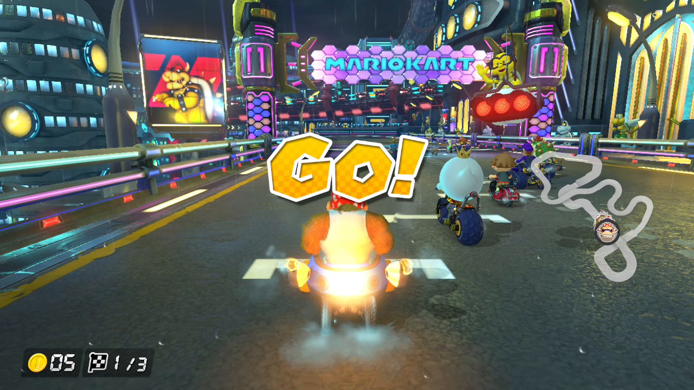
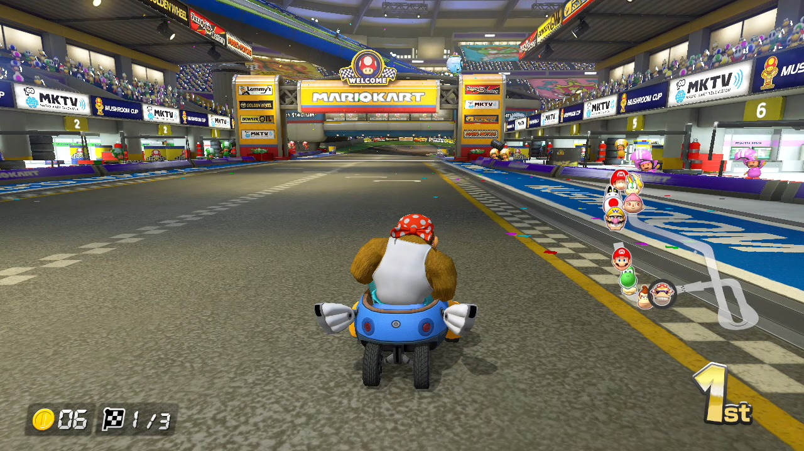

# switch-frame-tap

A Nintendo Switch sysmodule that streams the game you are playing to a PC
with no capture card, compressed with the console's own hardware H.264
encoder. Homebrew, built on and for the author's own console.

**The goal of this project is 1080p at 60 fps**: the game's native docked
resolution, at full frame rate, on any PC.

**Where it is today:** the first half of that goal is done. In **handheld
mode** it streams the console's **native 1280x720 at 60 fps** over a plain USB
cable. **Docked 1080p60** is the next and final stage; see
[the road to 1080p60](#the-road-to-1080p60).

> **It works, and it is playable.** Live mode streams whenever the PC viewer is
> open and a game is running, reattaches by itself when you close the viewer,
> close the game or start another one, and has been tested for several minutes
> at a time with Mario Kart 8 Deluxe (60 fps) and Zelda: Breath of the Wild
> (30 fps). Measured on the last run: **0 frames lost, 0 undecodable, 0 stale
> or torn frames in 6,965**; about **45 ms** from the game presenting a frame to
> it being on the PC screen (monitor not included).
>
> It is still **experimental**: handheld 720p only so far (1080p60 docked is
> the goal still ahead), two games tested, no audio, one console tested. Read
> [Limitations](#limitations) before installing it.



*A frame off the live stream, decoded on the PC from the console's own H.264
(Run M, live mode). [A 6.7 s clip of the stream](docs/stream-mk8-title-60fps.mp4)
is the console's bitstream exactly as it arrived over USB, only put in an MP4
container: 60 fps, keyframe every 60 frames. Below, the same clip as a small
animation.*


| | measured |
|---|---|
| Resolution / frame rate | 1280x720 (native handheld); the game's own rate: MK8D 57-59 fps, BOTW 29 fps |
| Transport | USB 2.0 bulk, the Switch's own USB-C port, no dock |
| Video | H.264 from the Switch's NVENC, constant QP 20, keyframe every 60 frames; ~40-55 Mbps in a race |
| Latency | ~20-23 ms on the console (game present -> sent) + ~21-24 ms on the PC (arrival -> on screen) |
| Reliability | 0 lost / 0 undecodable frames in every run since M84; 0 stale or torn frames (M89) |
| Console | Mariko, firmware 22.5.0, Atmosphère 1.11.2 (the only one tested) |

For comparison, [SysDVR](https://github.com/exelix11/SysDVR), the established
tool, is capped at 720p30 for game video, because it reads the system's own
game-recording encoder, whose settings are fixed in firmware. This project
takes the frame before that encoder.

## How it works

```
the game presents a frame (queueBuffer)
  | vi:u mitm sees it: which swapchain slot, and the GPU fence for it
  v
wait for the fence (the GPU is often still drawing: ~5-11 ms)
  v
svcReadDebugProcessMemory: copy the slot out of the game's memory
  |   (the kernel debug SVCs - the only route to another process's pixels)
  v
VIC: RGBA block-linear -> BT.709 NV12 (the Tegra's video compositor)
  v
NVENC: H.264, IDR + P frames (the job the system's own recorder builds)
  v
USB bulk -> tools/raw-recv/raw-view on the PC: libusb + libavcodec + SDL2
```

The sysmodule never touches the GPU or the display stack's buffers directly.
It watches the game's display traffic through a `vi:u` mitm, reads the
finished frame with the same debug SVCs Atmosphère's cheat engine uses, and
drives the VIC and NVENC engines itself over raw `nvdrv` ioctls.

## Quick start

**You need:** a Switch running Atmosphère (tested: Mariko, 22.5.0, 1.11.2), a
Linux PC, a USB-C cable, Docker, and a NAND backup. This drives hardware
engines directly; a bug can freeze the console (see
[If something goes wrong](#if-something-goes-wrong)).

**1. Build the sysmodule** (in the `devkitpro/devkita64` Docker image; the first
build compiles libstratosphere, ~15 minutes):

```bash
git clone --recursive https://github.com/Atmosphere-NX/Atmosphere ref/Atmosphere
bash tier4/applet-mitm/build.sh        # -> tier4/applet-mitm/applet-mitm.nsp
```

**2. Build the PC viewer**, and let it open the USB device without sudo:

```bash
sudo apt install libusb-1.0-0-dev libsdl2-dev libavcodec-dev libavutil-dev
make -C tools/raw-recv                 # must say "raw-view built WITH H.264"
sudo cp tools/raw-recv/99-switch-frame-tap.rules /etc/udev/rules.d/
sudo udevadm control --reload-rules && sudo udevadm trigger
```

**3. Install on the SD card** (card reader or Hekate USB mass storage):

```
sdmc:/atmosphere/contents/0100000000000C20/exefs.nsp          <- applet-mitm.nsp
sdmc:/atmosphere/contents/0100000000000C20/flags/boot2.flag   <- an empty file
sdmc:/applet-mitm.armed                                        <- one line, below
```

```
vic exec dbg usb nvgop=60 live wait=20
```

There must be **no** `mitm.lst` in that contents folder.

**4. Stream.** Handheld, USB-C cable from the Switch to the PC. Start the viewer,
then boot and launch a game:

```bash
tools/raw-recv/raw-view                # --record FILE.sft to also save the stream
```

The picture appears a few seconds after the game is on screen (and at the
earliest 20 s after boot: `wait=20`). The window title shows the frame rate,
the bitrate and both latencies. Close the viewer or the game whenever you like;
the stream picks up again when both are back.

The sysmodule logs to `sdmc:/applet-mitm.log` (rewritten at every boot) and to
`sdmc:/applet-mitm.last`, a one-line breadcrumb that survives a forced
power-off.

## Limitations

- **Handheld only.** It streams through the Switch's USB-C port in device mode,
  and docked, the dock owns that port. Docked 1080p needs a network transport
  (not started).
- **Two games tested:** Mario Kart 8 Deluxe (three 1920x1080 buffers) and
  Zelda: Breath of the Wild (two). Other games should work if their swapchain
  is block-linear RGBA, at most 1920x1080, in one memory object; the log says
  so if not. Colours are verified for the A8B8G8R8 format those two use.
- **No audio** yet.
- **The PC viewer is Linux-only** as written (libusb, SDL2, libavcodec; porting
  is plausible but not done).
- **It debug-attaches to the running game.** A process can have one debugger,
  so expect Atmosphère's cheat engine (dmnt) and similar tools not to work on
  a game while it is being streamed.
- **Occasional micro-stutters** during loading and heavy scenes: reads,
  the VIC and NVENC are shared with the whole system (NVENC also with the
  console's own background recording), and a frame can take 50-200 ms then.
- **Bitrate is not tuned.** P frames are about 60% of a keyframe in a fast
  race at QP 20; ~40-55 Mbps fits USB 2.0 (~290 Mbps) easily but is more than
  it needs to be.
- **One console tested.** Mariko, firmware 22.5.0, Atmosphère 1.11.2.

## If something goes wrong

Delete `atmosphere/contents/0100000000000C20/` from the SD card on a PC, or
boot holding **Volume Up**, which makes Atmosphère skip `contents` sysmodules.
Nothing here touches NAND or the bootloader. Keep a NAND backup anyway.

Read the SD card through a card reader or Hekate's USB mass storage, **not
MTP**: MTP returns I/O errors on a log whose tail was cut by a forced
power-off. Copy the log off before the console boots Atmosphère again.

## How this was built — with an AI, openly

I built this together with **Claude** (Anthropic's AI model, through Claude
Code). That should change how you read and trust what's here.

- **Claude** wrote nearly all of the code and the documentation, did the
  source-reading (Atmosphère and its kernel mesosphere, NVIDIA's open headers,
  switchbrew, reference drivers), designed each hardware probe, and
  interpreted the logs that came back.
- **I** set the goal and the direction, ran every one of the 87 hardware test
  cycles on my own console, read the logs back off the SD card, decided which
  routes to keep pushing and when to drop one, and decided what to publish.

What that means for you:

- **"Verified on hardware" means exactly that**: a real run on a real console,
  with the log, committed under [`logs/`](logs). Conclusions drawn from reading
  source rather than running it are labelled as such.
- **The AI got things wrong, and some mistakes were not cheap**: bugs that froze
  the console, one that fataled another sysmodule at boot, a timing figure
  (a "119 ms" VIC blit that was really SD-card logging) published before it
  was checked, and an early NVENC result over-read. Every one is recorded in
  [`tier4/mitm/STATUS.md`](tier4/mitm/STATUS.md), corrections left in place.
- **The history shows it.** Most commits carry a `Co-Authored-By: Claude`
  trailer.

Review it as you would a contribution from someone you haven't worked with
before, which is good advice for homebrew that drives hardware engines anyway.

---

## The research

The full log, newest first, with every dead end and its evidence, is
[`tier4/mitm/STATUS.md`](tier4/mitm/STATUS.md). The map for picking the
project up is [`tier4/mitm/PROJECT-HANDOFF.md`](tier4/mitm/PROJECT-HANDOFF.md);
the early narrative is [`tier4/mitm/WRITEUP.md`](tier4/mitm/WRITEUP.md). The
highlights:

### Getting the pixels: three routes closed, one open

A sysmodule can process frames at full speed; getting hold of one is the
problem. Three routes through the graphics stack were each taken to a definite
verdict:

| route | verdict |
|---|---|
| Import the game's swapchain `nvmap` handle (`FROM_ID` + `MAP_CMD_BUFFER`) | Pins to `phys=0`, silently, whatever the flags, permission mask or aruid. **Structural:** nvservices maps client memory through the handle of the process that initialised it, and the game's pages are in the game's process. |
| `vi` indirect layers (`GetIndirectLayerImageMap`) | `0x60A`. The object graph builds and the layer stays empty: attaching an application's layer to an indirect layer is AM's job. |
| Read back the display controller | No such ioctl in nvdrv. |

The route that works goes around the graphics stack: `svcDebugActiveProcess`
+ `svcReadDebugProcessMemory`, with `"force_debug": true` in the NPDM (as
`creport` and `dmnt.gen2` declare). mesosphere's permission check ignores the
`DeviceShared` attribute that sank the nvmap route (`kern_k_page_table_base.cpp`),
and a whole 1080p slot reads in ~5 ms. Two things are needed to stay attached
without hurting the game:

- **A debug event pump.** While attached, every thread start or exit in the
  game suspends *all* its threads until the debugger continues
  (`KDebugBase::ProcessDebugEvent`). Loading screens start threads; the first
  stream froze on one. `applet_mitm_dbgpump.cpp` does what dmnt's cheat engine
  does: block on the debug handle, drain, continue - on the new thread's core.
- **Never hold the game's graphics resources.** Importing the game's buffer
  handle or adopting its aruid in our nvdrv session kept an exited game's
  memory alive, and the next launch hung on a black screen. Live mode uses
  only its own buffers.

### Reading a finished frame

The mitm sees `queueBuffer` when the game *submits* a frame, and the GPU is
often still drawing it: queueBuffer carries an acquire fence, which the
compositor waits on. Reading early produced torn frames and whole frames from
two or three presents back. The capture now snapshots the slot and its fence
together (a seqlock against the binder thread), waits for the fence (measured:
5.5 ms average in MK8D, 7.5-11 ms in BOTW), then reads. `tools/sft_tool.py
artifacts` counts both artifacts in a recording: 29 stale / 22 torn per 3000
frames before, 0 / 0 after.

### Driving the Tegra engines from a sysmodule

- **VIC** over raw nvdrv, byte-exact: `SETCL` is mandatory (nvservices, unlike
  the Linux DRM driver, does not set the class), relocs are inert on Horizon
  (pin with `MAP_CMD_BUFFER` and inline the address), the syncpoint increment
  must be in the command stream, and a zero address hangs the VIC and with it
  the compositor.
- **The VIC's colour matrix, solved.** Three attempts produced a flat picture;
  an 11-probe sweep gave an exact law (`out = sum(K * in) * 2^-(8 + shift) +
  offset`, [`tools/vic_csc.py`](tools/vic_csc.py)) that reproduces all 528
  measured values. The stream uses real BT.709 limited range.
- **Block-height units differ:** the VIC's is log2 of GOBs; NVENC's
  `block_height` value 2 means 16 rows. Mismatched, the encode came out
  perfectly scrambled.
- **NVENC was never "unbooted firmware" - it was unclocked.** On Horizon a
  client requests the engine's clock from `mm:u` before using it (as averne's
  FFmpeg nvtegra code does); an unclocked engine accepts a job and never runs
  it. With the clock up, the job the system's own recorder (grc) builds,
  captured from grc and replayed from our own channel, encodes correctly;
  constant QP works through RCMODE 0; `error_status` 2 is routine (grc's own
  frames carry it). P frames use grc's P setup and job with the references
  ping-ponging; the drift test (last frame of a 59-P-frame chain against the
  console's own picture) passes at 42 dB.



*The last frame of a 30-frame IDR + P chain encoded on the console (Run K),
decoded on the PC: 42 dB against the console's own picture of it.*

### The transport

USB 2.0 bulk through `usb:ds` saturates at ~37 MB/s from this module (measured
across five resolutions), which is why raw pixels stopped at 768x432 and the
stream is H.264. Transfers that time out are cancelled, so a newly opened
viewer never starts mid-frame. SuperSpeed descriptors (including the BOS
`usbDsSetBinaryObjectStore` needs) are accepted but the link still trains to
High Speed on the cable tested.

### Pieces you might want on their own

- **Non-domain mitm sub-object forwarding for libstratosphere**
  ([`tier4/applet-mitm/patch_libstrat.py`](tier4/applet-mitm/patch_libstrat.py),
  55 lines): Atmosphère's mitm framework forwards undeclared commands only on
  domain sessions; `vi:u` hands out its sub-objects on non-domain ones. If you
  have tried to mitm `vi` and given up, this is the missing piece.
- **A transparent `vi:u` mitm** that recovers every frame's layout from the
  binder traffic (`setPreallocatedBuffer`, `queueBuffer` with its fence), and
  handles both `GetDisplayService` and `GetDisplayServiceWithProxyNameExchange`
  (command 1, used by BOTW: its request is forwarded byte for byte).
- **Undocumented `vi` ABIs:** `CreateIndirectLayer` (2050),
  `CreateIndirectProducerEndPoint` (2052), `CreateIndirectConsumerEndPoint`
  (2054), all `{u64, u64} -> u64`; `GetDisplayService`'s command id is the
  service type (`vi:u` 0, `vi:s` 1, `vi:m` 2).
- **A dmnt-style debug event pump** for any sysmodule that stays attached to a
  game.
- **PC tools with self-tests** (`bash tools/run_pc_tests.sh`): the viewer,
  `sft_tool.py` (recording stats, drift test, artifact detector), the VIC matrix
  model, NVENC setup decoders.

Earlier captures, kept for the record: the game's swapchain read out at native
1080p and de-swizzled on the PC ([`docs/frame-1080p.png`](docs/frame-1080p.png)),
and the raw 768x432 "packed 4:2:0" stream that preceded H.264
([`docs/frame-stream-packed420.png`](docs/frame-stream-packed420.png)).

## The road to 1080p60

The final goal is the game's native docked output, **1920x1080 at 60 fps**,
streamed to a PC. Everything upstream of the encoder already works at that
size: the capture reads full 1080p swapchain slots (the earliest captures were
native 1080p, [`docs/frame-1080p.png`](docs/frame-1080p.png)), and the VIC
converts and scales any size. What is left:

1. **A 1080p NVENC setup.** The encoder job used today is the one the system's
   own recorder builds, and that is 1280x720 (Switch video clips are 720p), so
   there is no 1080p job to copy. The setup fields that scale with the picture
   are known (size, SPS, history and bitstream buffers, slice control, surface
   configs); it will be built and verified on the PC first, then on hardware
   with a single frame, as the 720p setup was.
2. **A network transport.** Docked, the dock owns the console's only USB-C
   port, so USB device mode is not available. 1080p60 H.264 with P frames is
   tens of Mbps, which suits Wi-Fi or a LAN adapter in the dock. The PC side
   exists in part (`switch-stream/receiver` speaks TCP).
3. **Frame budget.** At 1080p the read, the VIC and NVENC each handle 2.25x
   the pixels of 720p; the current per-frame work (~9-10 ms at 720p, of a
   16.7 ms budget) says it should fit, and the first 1080p run will measure it.

## Roadmap

| stage | state |
|---|---|
| Capture the game's frames (`vi:u` mitm + debug SVCs) | **done, on hardware** |
| VIC conversion to BT.709 NV12 | **done, on hardware** |
| NVENC H.264, IDR + P frames | **done, on hardware**; no drift over 59-frame chains |
| USB transport + live PC viewer with latency readout | **done, on hardware** |
| Live mode: viewer and game come and go | **done, on hardware** (M86-M86b) |
| Games beyond MK8D (per-game swapchain geometry, `vi:u` command 1) | **done for BOTW** (M87); others untested |
| Frame-exact capture (GPU fence, slot+fence snapshot) | **done, on hardware** (M88-M89): 0 stale, 0 torn |
| Bitrate tuning (better P frames, QP) | next; also lowers what 1080p60 needs from the network |
| **Docked 1080p60 over the network - the final goal** | not started: a 1080p encoder setup (grc's is 720p) and a network transport, see [above](#the-road-to-1080p60) |
| Audio | not started |
| Windows viewer | not started |
| USB 3.0 lossless (handheld) | parked: the link still trains to High Speed |
| Home menu and system overlays | not possible through any route found |

## Layout

| path | what |
|---|---|
| `tier4/applet-mitm/` | The sysmodule: `vi:u` mitm, binder intercept, debug-SVC capture and event pump, VIC and NVENC over raw nvdrv, USB. |
| `tools/raw-recv/` | `raw-view`, the PC viewer (and `raw-recv`, the raw-frame receiver it grew out of). |
| `tools/` | PC-side analysis and self-tests: `sft_tool.py`, `nvframe_check.py`, `nvp_check.py`, `vic_csc.py`, `nvenc_replay.py`, `nvrec.py`. |
| `tier4/mitm/` | `STATUS.md` (the research log), `PROJECT-HANDOFF.md` (the map), `WRITEUP.md`. |
| `logs/` | The hardware runs' logs and checked outputs. |
| `docs/` | Images and the stream clip. |
| `tier4/recon/`, `tier4/stream-oc/`, `switch-stream/` | Early side projects: a diagnostic sysmodule, an overclock companion, a first streamer attempt. Historical. |
| `ref/` | Not committed: third-party reference trees, see [`ref/README.md`](ref/README.md). |

## Contact

Questions, corrections, or if you want to take a piece of this further - I'd
genuinely like to hear about it.

- **Email:** Some_Potato_1@protonmail.com
- **Reddit:** [u/Papux200](https://www.reddit.com/user/Papux200)
- **Issues:** [GitHub issues](https://github.com/TomasUribe/switch-frame-tap/issues)

Forks are welcome and no permission is needed.

## License

GPL-2.0. `tier4/applet-mitm` links libstratosphere and ships a patch against
it, so it is a derivative of Atmosphère and could not be anything else. See
[LICENSE](LICENSE) and [NOTICE](NOTICE).
