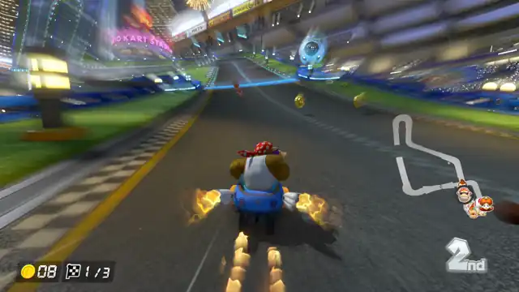
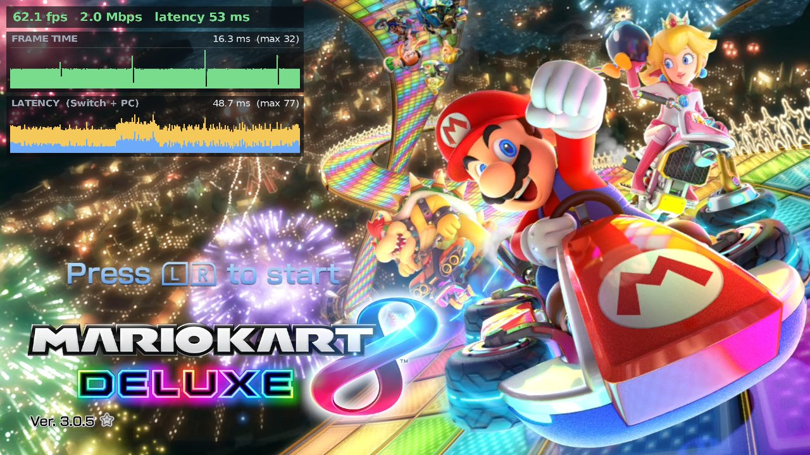
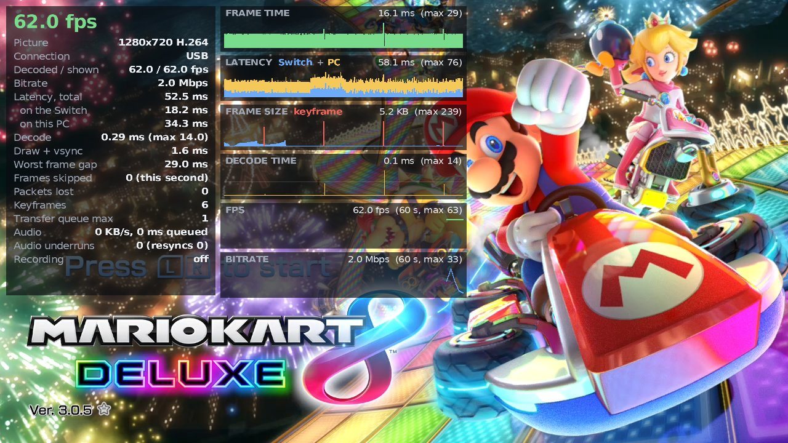
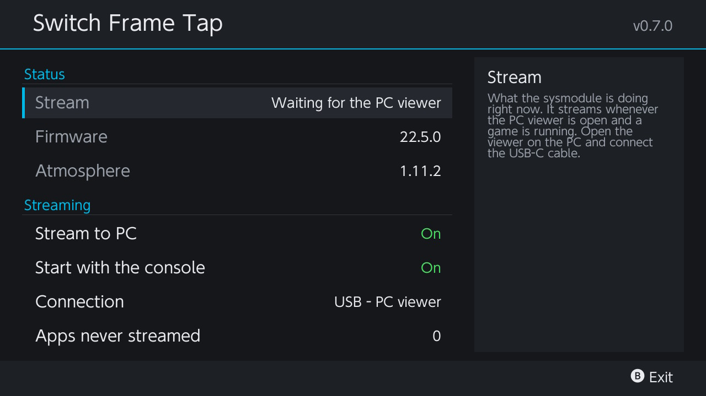
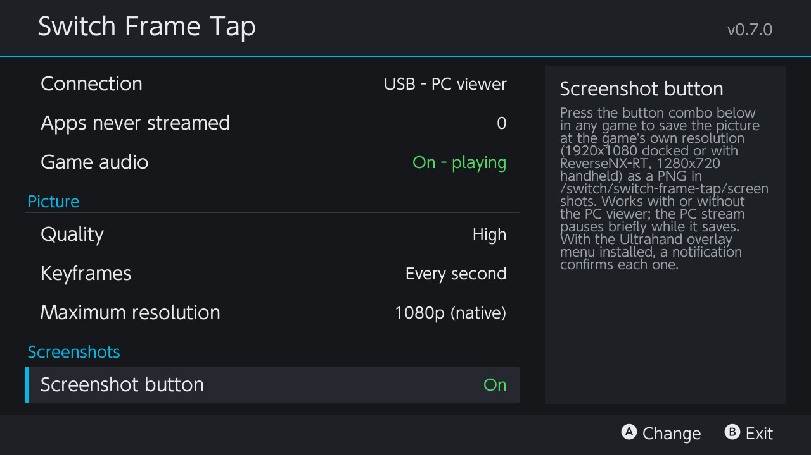
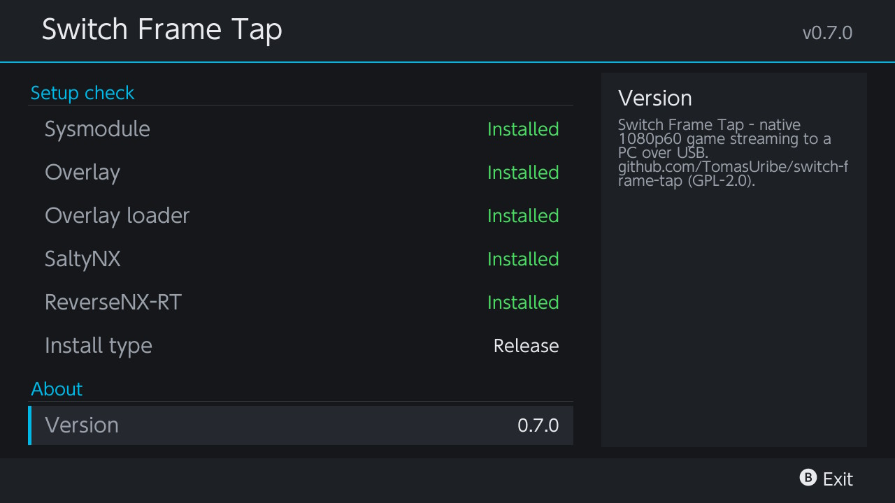
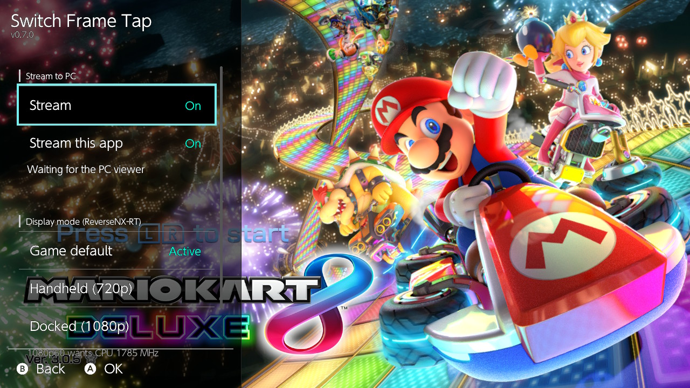

# switch-frame-tap

A Nintendo Switch sysmodule that streams the game you are playing - picture
and sound - to a Windows or Linux PC over a USB cable, or over the network so
you can play docked, with no capture card, compressed with the console's own
hardware H.264 encoder. With a manager app,
an overlay, native-resolution screenshots, **recording to MP4** from the
viewer, and a **webcam mode** that makes the Switch a plain USB camera - for OBS, or for any camera app. Homebrew, built on and for the
author's own console. **[Download the latest release](https://github.com/TomasUribe/switch-frame-tap/releases/latest)**.

**The goal of this project is 1080p at 60 fps**: the game's native docked
resolution, at full frame rate, on any PC.

**Where it is today: 1080p60 works.** Over a plain USB cable it streams
**native 1920x1080 at the game's 60 fps** whenever the game renders 1080p, and
the console's native 1280x720 at 60 fps in ordinary handheld mode. The USB
port is only free in handheld, so 1080p over USB uses
[ReverseNX-RT](https://github.com/masagrator/ReverseNX-RT) to make the game
render its docked picture in handheld (Run W: 59.5-59.9 fps sent per 20 s
window against the game's ~59.2, 0 errors). See
[the road to 1080p60](#the-road-to-1080p60) for what is left.

> **It works, and it is playable.** Live mode streams whenever the PC viewer
> (Windows or Linux) is open and a game is running - with its sound -
> reattaches by itself when you close the viewer, close the game or start
> another one, and has been played with Mario Kart 8 Deluxe (60 fps), Zelda:
> Breath of the Wild and Ocarina of Time on Nintendo Switch Online (30 fps),
> and homebrew apps started from HOME-menu forwarders. **0 frames lost, 0
> undecodable, 0 stale or torn frames** in the measured runs; about **45 ms**
> (720p) to **60 ms** (1080p) from the game presenting a frame to it being on
> the PC screen (monitor not included).
>
> Since v0.7.0 it also streams **over the network** - Wi-Fi or the dock's
> LAN port - so a docked console streams its native 1080p too, with the
> quality adapting to what the network carries.
>
> It is still **experimental**: tested on the author's console (and a Switch
> Lite by a user). Read [Limitations](#limitations) before installing it.

| | |
|---|---|
|  |  |
|  |  |

*Screenshots taken on the console with the screenshot button (L3 + R3), at
the game's own resolution: Mario Kart 8 Deluxe at 1920x1080 (docked picture
through ReverseNX-RT, in handheld), Ocarina of Time on Nintendo Switch Online
at 1280x720 - the same frames the stream sends.*



*Recorded with the viewer's **R** key (v0.5.0): Mario Kart 8 Deluxe at native
1920x1080, 60 fps (the docked picture through ReverseNX-RT, in handheld). The
animation is 4 seconds of it scaled down; **[the whole 30-second recording](https://github.com/TomasUribe/switch-frame-tap/releases/download/v0.5.0/switch-frame-tap-sample-mk8-race-1080p60.mp4)**
(381 MB, 1080p60 with sound) is the file exactly as the viewer saved it - the
console's own H.264, never re-encoded: 1792 frames, 59.3 fps, 0 decode errors.*


*A frame off the live stream, decoded on the PC from the console's own H.264
(Run M, live mode). [A 6.7 s clip of the stream](docs/stream-mk8-title-60fps.mp4)
is the console's bitstream exactly as it arrived over USB, only put in an MP4
container: 60 fps, keyframe every 60 frames. Below, the same clip as a small
animation.*


| | measured |
|---|---|
| Resolution / frame rate | **1920x1080** when the game renders it (docked picture via ReverseNX-RT): MK8D 58.4 fps over a session, 59.5-59.9 per window; 1280x720 native handheld: MK8D 57-59 fps, BOTW 29 fps |
| Transport | USB 2.0 bulk, the Switch's own USB-C port, no dock |
| Audio | the game's sound, 48 kHz stereo PCM, from the console's own recorder (grc:d); ~1.5 Mbps alongside the video |
| Video | H.264 from the Switch's NVENC, constant QP 20 (P frames 22, v0.6.0), keyframe every 60 frames; 1080p ~80 Mbps in a fast race, 720p about half; the manager's Medium / Low quality roughly half / a third of that |
| Latency | 720p: ~20-23 ms on the console (game present -> sent) + ~21-24 ms on the PC (arrival -> on screen); 1080p: ~34 + ~25 ms |
| Reliability | 0 lost / 0 undecodable frames in every run since M84; 0 stale or torn frames (M89) |
| Console | Mariko, firmware 22.5.0, Atmosphère 1.11.2 (the only one tested) |

For comparison, [SysDVR](https://github.com/exelix11/SysDVR), the established
tool, is capped at 720p30 for game video, because it reads the system's own
game-recording encoder, whose settings are fixed in firmware. This project
takes the frame before that encoder.

## How it works

```
the game presents a frame (queueBuffer)
  | vi:u mitm (games) / vi:m mitm (homebrew) sees it: which swapchain slot,
  | and the GPU fence for it
  v
take the newest frame the GPU has finished (or wait for the next one)
  v
svcReadDebugProcessMemory: copy the slot out of the game's memory
  |   (the kernel debug SVCs - the only route to another process's pixels)
  v
VIC: RGBA block-linear -> BT.709 NV12 (the Tegra's video compositor)
  v
NVENC: H.264, IDR + P frames (the job the system's own recorder builds)
  v
USB bulk -> the viewer on the PC (Windows / Linux): libusb + libavcodec + SDL2

grc:d (the console's own recorder): the game's sound, 48 kHz stereo PCM
  -> the same USB stream, a packet before each frame -> played in step
```

The sysmodule never touches the GPU or the display stack's buffers directly.
It watches the game's display traffic through a `vi:u` mitm (and homebrew's
through `vi:m`, for the running application only), reads the
finished frame with the same debug SVCs Atmosphère's cheat engine uses, and
drives the VIC and NVENC engines itself over raw `nvdrv` ioctls. The sound
comes from `grc:d`, the recorder behind the console's own video clips.

## What you need

**Required** - enough to stream at 720p60, take screenshots and use the
manager app:

| | |
|---|---|
| A Switch running **Atmosphère** custom firmware | [Atmosphère releases](https://github.com/Atmosphere-NX/Atmosphere/releases) - tested with 1.11.2 on firmware 22.5.0 (Mariko). New to custom firmware: the [NH Switch Guide](https://switch.hacks.guide/). Keep a NAND backup. |
| The **homebrew menu** | Comes with Atmosphère (`hbmenu.nro`); also [nx-hbmenu releases](https://github.com/switchbrew/nx-hbmenu/releases). It opens the manager app. |
| A **Windows or Linux PC** | Windows 10/11: the viewer zip, plus the WinUSB driver installed once with [Zadig](https://zadig.akeo.ie/). Linux: `libusb`, `SDL2`, `libavcodec` - one `apt install` line. Both [below](#install). In [webcam mode](#webcam-mode), no viewer or driver: OBS reads it as a camera. |
| A **USB-C cable**, or a **network** | USB 2.0 is plenty; over USB the Switch stays in handheld (the dock owns the port). [Network streaming](#network-streaming-play-docked) needs no cable and works docked: Wi-Fi or the dock's LAN port, the PC on the same network. |

**Optional** - one per feature. Since v0.7.5 the manager app's **Get extras**
installs each of them from its author's GitHub release (see
[below](#get-extras)); or download them yourself from the links:

| for | install | notes |
|---|---|---|
| **The overlay** (stream on/off, "Stream this app" and handheld/docked from inside a game) | an overlay menu: [Ultrahand Overlay](https://github.com/ppkantorski/Ultrahand-Overlay/releases) (its `sdout.zip` includes the loader, nx-ovlloader), **or** [Tesla Menu](https://github.com/WerWolv/Tesla-Menu/releases) with [nx-ovlloader](https://github.com/WerWolv/nx-ovlloader/releases) | Without one, everything is still in the manager app except handheld/docked. |
| **1080p** over USB in handheld (docked over the network is 1080p by itself) | [SaltyNX](https://github.com/masagrator/SaltyNX/releases) and [ReverseNX-RT](https://github.com/masagrator/ReverseNX-RT/releases) (tested: SaltyNX 2.0.0) | ReverseNX-RT makes the game render its docked (1080p) picture in handheld; it needs an overlay menu too. Official games only. |
| **1080p at a full 60 fps** | a clock tool: [sys-clk](https://github.com/retronx-team/sys-clk/releases) or [Horizon OC](https://github.com/Horizon-OC/Horizon-OC) | CPU 1785 MHz (Nintendo's boost clock). At the stock clock 1080p runs a little below 60. |
| **Screenshot notifications** | [Ultrahand Overlay](https://github.com/ppkantorski/Ultrahand-Overlay/releases) | Screenshots work without it; Ultrahand only shows the "Screenshot saved" toast. |
| **Sound in games that block recording** (Smash) | nothing - [dvr-patches](https://github.com/exelix11/dvr-patches) come bundled, off | Turn on **Sound in no-record games** in the manager or the overlay and restart ([below](#sound-in-games-that-block-recording)). |

Nothing else: no other sysmodule, no sigpatches, no capture card.

## Install

This drives hardware engines directly; a bug can freeze the console (see
[If something goes wrong](#if-something-goes-wrong)).

**1. The Switch.** Download `switch-frame-tap-0.7.7-switch.zip` from the
[release](https://github.com/TomasUribe/switch-frame-tap/releases) and unzip
it onto the root of the SD card (card reader or Hekate USB mass storage). It
contains:

```
atmosphere/contents/0100000000000C20/        the sysmodule (starts at boot)
switch/switch-frame-tap/switch-frame-tap.nro  the manager app (homebrew menu)
switch/.overlays/switch-frame-tap.ovl         the overlay (Tesla / Ultrahand)
```

Reboot. Updating later is the same: unzip over it; your settings are kept.

**2a. The PC viewer on Windows.** Unzip
`switch-frame-tap-0.7.7-windows-viewer.zip` anywhere. Once, with the Switch
connected and running: open [Zadig](https://zadig.akeo.ie/), **Options ->
List All Devices**, pick **Switch Frame Tap** (USB ID 1209 5F1E - make sure
it is that one), choose **WinUSB** and **Install Driver**. Then double-click
`SwitchFrameTap.exe` (keep the two DLLs next to it; the zip is 2 MB). Windows may warn about an
unknown publisher: **More info -> Run anyway**.

**2b. The PC viewer on Linux.** Install the build dependencies and the udev
rule (lets the viewer open the Switch without sudo), then the desktop app:

```bash
sudo apt install build-essential libusb-1.0-0-dev libsdl2-dev libavcodec-dev libavutil-dev libavformat-dev
sudo cp tools/raw-recv/99-switch-frame-tap.rules /etc/udev/rules.d/
sudo udevadm control --reload-rules && sudo udevadm trigger
bash tools/raw-recv/install-launcher.sh
```

That puts a double-clickable **Switch Frame Tap** on the desktop and in the
applications menu. The release also has
`switch-frame-tap-0.7.7-linux-viewer.tar.gz` with the same files.

On both, the viewer opens a window that says what it is waiting for (the
Switch, its USB driver, or a game) and lists its keys; the same screen comes
back whenever the game is closed or not on screen (the HOME menu) instead of
a frozen frame. It reconnects on its own and closes only when you close it. It plays the game's sound on the
default audio device.

| key | |
|---|---|
| **R** | record / stop recording (below) |
| **M** | mute / unmute the game's sound |
| **F11** or a double-click | fullscreen |
| **Esc** | leave fullscreen / close |
| **Tab** | the connection: USB / Network (v0.7.0; remembered) |
| **I** | type the Switch's IP address (Network, if it is not found by itself) |
| **O** or **F3** | the stats overlay: off / FPS / graphs / full (v0.7.2; remembered) |

It reads USB, decodes and draws on separate threads and shows the frames in
order, one per screen refresh (vsync), so the picture stays smooth. Its
statistics - frame rate, latencies, decode and draw times, once a second - go
to the terminal on Linux and to `%APPDATA%\switch-frame-tap\viewer\viewer.log`
on Windows.

**The stats overlay** (v0.7.2): **O** or **F3** steps through four levels -
off; **FPS**, a counter in the corner (yellow or red when frames come
unevenly); **graphs**, frame rate, bitrate and latency with a frame-time graph
and a latency graph split into the Switch's part and the PC's; and **full**,
every number the viewer keeps (decode and draw times, skipped frames, lost
packets, keyframes, the audio buffer, ...) with six graphs. It scales with the
window, and the level is remembered.

|  |  |
|---|---|

**Recording (v0.5.0).** Press **R** in the viewer: from the next keyframe (within
a second) it saves an MP4 to `Videos/Switch Frame Tap` - the console's H.264
exactly as it arrived, never re-encoded, so no quality is lost and it costs
almost no CPU, plus the game's sound (AAC). **R** again stops. A red dot
shows while it records, and the title bar the time and size. At 1080p it is
about 10 MB a second (~600 MB a minute) at High quality, half that at Medium. The file is written in fragments, so
a recording cut short by closing the window or pulling the cable still plays;
if the game switches between 720p and 1080p mid-recording it continues in a
new file; it will not start with less than 1 GB free and stops by itself
below 500 MB.

**3. Stream.** Connect the Switch (handheld) to the PC with the USB-C cable,
open the viewer and start a game. The picture appears a few seconds after the
game is on screen (at the earliest 20 s after boot). Close the viewer or the
game whenever you like; the stream picks up again when both are back.

**1080p.** Install [SaltyNX and ReverseNX-RT](https://github.com/masagrator/ReverseNX-RT)
and pick **Docked (1080p)** in the Switch Frame Tap overlay (or ReverseNX-RT's
own): the game renders its docked picture and the stream switches to
1920x1080 by itself. 1080p60 wants **CPU 1785 MHz** (Nintendo's own boost
clock; GPU 768 / RAM 1600, the docked values) from a clock tool such as
Horizon OC or sys-clk; at the stock 1020 MHz it runs, a little below 60.
Expect more heat and battery drain, and some games dislike fake docked mode
(MK8D crashes with Joy-Cons attached; use a Pro Controller).

### The manager app

| | |
|---|---|
|  |  |
|  |  |

*The manager app from the homebrew menu (status and connection, picture and
screenshot settings, the setup check) and the overlay over a game - v0.7.0,
captured on the console.*

**Switch Frame Tap** in the homebrew menu: what the stream is doing (and its
frame rate), streaming on/off, start with the console, USB mode (PC viewer or
webcam), picture quality
(High/Medium/Low), keyframe interval, maximum resolution (1080p/720p), game
audio on/off, sound in no-record games, start delay, screenshots, **Get
extras** (below) and a setup check. Changes apply at once - a running stream
restarts with them. Settings live in `sdmc:/config/switch-frame-tap/config.ini`.

### Get extras

The optional tools, installed from the manager app with the Switch online:
**Ultrahand Overlay** (the overlay menu, with nx-ovlloader), **SaltyNX** and
**ReverseNX-RT** (1080p over USB), and an overclock tool for 1080p at 60 fps -
**sys-clk** or **Horizon OC**, one or the other. Each row says whether it is
installed; A twice downloads the latest release from its author's GitHub page
(over HTTPS, checked against the console's own certificates) and unpacks it
onto the SD card, keeping the tool's existing settings files. Tools that run at
boot need a restart. Horizon OC: its authors warn that RAM overclocking can
corrupt the NAND or SD card, an update resets its settings, and with Hekate the
boot entry needs `kip1=atmosphere/kips/hoc.kip` (the manager says when it is
missing).

### The overlay

Needs an overlay menu (Tesla Menu or Ultrahand, on nx-ovlloader): stream
on/off (remembered across reboots), live status, **Stream this app** (see
below), **Enable sound in no-record games** (below), and Game default /
Handheld (720p) / Docked (1080p) through ReverseNX-RT.

### Sound in games that block recording

The game's sound comes from the console's own video recorder, and some games
turn it off (Super Smash Bros. Ultimate, for one): the picture streams, the
sound does not. [dvr-patches](https://github.com/exelix11/dvr-patches) (by
exelix11, made for SysDVR, BSD-3) patch the system so the recorder runs for
every game, and then the sound comes through. They come with Switch Frame Tap
(v0.7.4), **off**:

1. In the manager app (or the overlay), turn **Sound in no-record games** on.
2. Restart the console.

It applies to every game while on. If a game crashes with it (a crash report
for `0100000000000023`), turn it off again and restart. The patches are kept
in `config/switch-frame-tap/dvr-patches/`; turned on, they are copied to
`atmosphere/exefs_patches/switch-frame-tap-sound/`. They are tied to the
firmware: a Switch Frame Tap update brings new ones, and the sysmodule
refreshes the copy at boot. dvr-patches installed by hand (in
`atmosphere/exefs_patches/am`) are recognised, and the switch turns them off
too. (Recording the console's final mix through `audrec:u` instead was tried:
it records, but a game that blocks recording is silent in it.)

### Webcam mode

Set **Connection** to one of the two webcams in the manager and restart the
console: the Switch then shows up on the PC as a USB camera, **Switch Frame
Tap Camera**. No viewer and no driver. The camera app picks the size; the
picture is scaled to it.

| Connection | format | sizes | for |
|---|---|---|---|
| **USB - webcam (OBS)** | H.264 | 1920x1080 or 1280x720 at 60 fps | OBS (best quality) |
| **USB - webcam (any app)** | uncompressed NV12 | 1280x720 at 25 fps, or 768x432 at 60 | the Windows Camera app, browsers, Discord, Zoom, Teams - any camera app |

The "any app" camera sends every frame uncompressed straight from the
console's video engine, so nothing on the PC has to decode it (no decoder
delay either); USB 2.0's ~37 MB/s is what limits 720p to 25 fps.

**1080p60 in any app:** use **webcam (OBS)**, add it in OBS as a Video
Capture Device, click **Start Virtual Camera**, and pick **OBS Virtual
Camera** in Discord, Zoom, Teams, the Camera app or the browser. (An
uncompressed 1080p frame is 3.1 MB - about 11 fps over USB 2.0 - so the "any
app" camera stops at 720p.)

- **OBS:** add a **Video Capture Device**, pick Switch Frame Tap Camera, and set
  **Buffering** to **Disable**. Latency is higher than with the viewer: OBS's
  H.264 camera decoder holds back several frames
  ([an OBS issue](https://github.com/obsproject/obs-studio/pull/13462), not
  the console's). On Linux OBS reads it through v4l2.
- **No sound** in webcam mode: a USB microphone needs isochronous transfers,
  which the Switch's USB device service cannot do. Use the viewer for sound.
- **The Windows Camera app does not open the H.264 camera** (it wants
  uncompressed or MJPEG cameras): use **webcam (any app)** for it.
- On Linux, `tools/raw-recv/uvc-check` (`make -C tools/raw-recv uvc-check`)
  streams either camera for a few seconds and reports frame rate and errors
  (`--size 1080|720|432`, `--shot frame.ppm` for the uncompressed one).
- Changing the mode needs a restart (the USB descriptors are set at boot). Set
  it back to **PC viewer** the same way.

Measured (Linux, v4l2): H.264 60.0 fps at 1920x1080 and 60.1 fps at
1280x720, 0 decode errors, first frame 0.4-0.8 s after the camera opens; OBS
on Windows works. Uncompressed: 26.0 fps at 1280x720 and 60.0 fps at
768x432, every frame complete, first frame 0.4-1.1 s after opening.

The USB camera side follows Insektaure's
[SysDVR-UVC-Capture](https://github.com/Insektaure/SysDVR-UVC-Capture)
(GPL-2.0), whose research into `usb:ds` control transfers made it possible.

### Network streaming (play docked)

Set **Connection** to **Network** in the manager and restart the Switch; in
the viewer, press **Tab** until it says **Connection: Network** (it is
remembered). With the Switch and the PC on the same network - Wi-Fi, a phone
hotspot or the dock's LAN port - the viewer finds the console by itself: the
address that worked last time, the console's broadcast, or a quick scan of the
network (many Wi-Fi routers drop broadcasts between wireless devices, so the
scan is what finds it there). **I** in the viewer types the Switch's IP by hand
(the manager shows it). One connection at a time: in Network mode the Switch
leaves USB alone.

The stream is the same as over USB - sound, recording, the menu - with one
addition: **the quality adapts to the network**. Five times a second the
Switch checks how busy its network sender is; when the link is full it codes
the next frames coarser, and when there is room again it steps back to your
quality setting. Frames never pile up, so the frame rate and the delay stay
steady and the picture gets softer in fast scenes instead.

- Latency is a little above USB (a 1080p frame takes a few ms to cross even a
  fast network).
- The network decides the picture: a close hotspot or a LAN adapter in the
  dock is best; a far-away or busy home Wi-Fi drops the quality more often.
  **Max resolution 720p** halves what the network has to carry.
- Windows asks once whether to allow the viewer through the firewall on
  private networks - allow it.

Measured (Run AO, before the rate control): docked 1080p on home Wi-Fi, the
Switch's link carried 20-29 Mbps; a fast race at Medium needed ~40, so frames
queued - 7-30 fps and 100-350 ms of delay. With the rate control on a phone
hotspot: smooth 60 fps, "very playable", latency a little above USB.

### Homebrew

Homebrew apps stream too - forwarders on the HOME menu, and the homebrew menu
in title-override mode - at the resolution the app draws (usually 1280x720).
ReverseNX-RT cannot switch homebrew to docked mode (it works through the
official SDK, which homebrew does not use), and most homebrew draws 720p in
both modes anyway. Some apps refuse to run while a debugger is attached - the
stream reads frames that way - such as TiCo's protected builds: turn **Stream
this app** off in the overlay while one is running and restart it; the
sysmodule then never touches it (no stream, no screenshots). The manager's
**Apps never streamed** clears the list.

### Screenshots

Turn on **Screenshot button** in the manager and press **L3 + R3** (or another
combo you pick there) in any game: the frame is saved as a PNG at the game's
own resolution - 1920x1080 docked or with ReverseNX-RT, 1280x720 handheld -
in `sdmc:/switch/switch-frame-tap/screenshots/`, with or without the PC
viewer (~0.4 s). With Ultrahand installed a notification confirms it. Browse,
view and delete them in the manager (**View screenshots**). The PNGs are
stored uncompressed: exactly the pixels the game drew, ~6 MB at 1080p.

### Logs

`sdmc:/config/switch-frame-tap/log.txt` (rewritten at every boot, capped at
4 MB) and `last.txt`, a one-line breadcrumb that survives a forced power-off.
Please attach both to a bug report.

## Building from source

```bash
git clone --recursive https://github.com/Atmosphere-NX/Atmosphere ref/Atmosphere
git clone https://github.com/WerWolv/libtesla ref/libtesla
bash tools/make_release.sh 0.7.7       # -> dist/switch-frame-tap-0.7.7-{switch.zip,linux-viewer.tar.gz,windows-viewer.zip}
bash tools/run_pc_tests.sh             # every check that needs no console
```

Everything builds in the `devkitpro/devkita64` Docker image (the first build
compiles libstratosphere, ~15 minutes). The PC viewer: `make -C tools/raw-recv`;
the Windows viewer is cross-compiled from Linux with Zig -
`bash tools/raw-recv/build-windows.sh VERSION` (after `build-ffmpeg-min.sh`
once, for FFmpeg built into the exe), toolchain listed in
[`ref/README.md`](ref/README.md). `raw-view --file REC.sft --paced` runs a
recording through the live pipeline (no console needed).

**Test installs.** With `sdmc:/applet-mitm.armed` on the card the sysmodule
ignores `config.ini` and reads its flags from that file instead
(`vic exec dbg usb nvgop=60 live wait=20` is the release behaviour), logging
to `sdmc:/applet-mitm.log` - how every development run was done.

## Limitations

- **USB is handheld only** (docked, the dock owns the USB-C port); docked play
  streams over the network (v0.7.0), where the picture quality depends on the
  network. One viewer at a time, and one connection (USB or network) per boot.
- **1080p60 wants CPU 1785 MHz.** The frame copy runs on the CPU; at the stock
  1020 MHz it is slower and 1080p runs a little below 60 (still playable).
- **Homebrew:** apps that run as applets (the homebrew menu from the album)
  are not streamed - use a forwarder or title override. Apps with anti-debug
  protection (TiCo) cannot be streamed; exclude them. Homebrew cannot be
  forced into docked mode.
- **A handful of games tested:** Mario Kart 8 Deluxe, Zelda: Breath of the
  Wild, Ocarina of Time (Nintendo Switch Online), Kirby and the Forgotten Land
  and several homebrew apps. Others should work if their swapchain is
  block-linear RGBA or BGRA, at most 1920x1088 and 10.5 MB a buffer; the log
  says so if not. Games that draw upside down and have the system flip the
  picture (Kirby: v0.4.1) are flipped back the same way; a 90-degree rotation
  is not handled (none seen yet - the log would say "rot-90").
- **Game audio** comes from the console's own video recorder (as with SysDVR):
  games that turn video capture off have no sound in the stream unless
  [Sound in no-record games](#sound-in-games-that-block-recording) is on.
- **Webcam mode:** picture only; the H.264 camera has higher latency in OBS
  than the viewer, the uncompressed one tops out at 720p25 (USB 2.0);
  switching modes needs a restart.
- **PC viewer: Windows and Linux** (x86_64). No macOS viewer yet. On Windows
  the driver needs Zadig once, as with SysDVR.
- **It debug-attaches to the running game.** A process can have one debugger,
  so expect Atmosphère's cheat engine (dmnt) and similar tools not to work on
  a game while it is being streamed.
- **Occasional micro-stutters** during loading and heavy scenes: reads,
  the VIC and NVENC are shared with the whole system (NVENC also with the
  console's own background recording), and a frame can take 50-200 ms then.
- **Bitrate is set by quality, not capped.** v0.6.0 made P frames about
  15-20% smaller (QP +2 on P frames, a better motion search); at the same
  quality x264 needs ~89% of the console's bits, so what remains is the price
  of "High" (near-lossless) at 1080p60. USB has room for it; a bitrate cap
  (the console's own rate control) comes with the network transport, where it
  is needed.
- **One console tested.** Mariko, firmware 22.5.0, Atmosphère 1.11.2.

## If something goes wrong

Turn off **Start with the console** in the manager and reboot; or delete
`atmosphere/contents/0100000000000C20/` from the SD card on a PC; or boot
holding **Volume Up**, which makes Atmosphère skip `contents` sysmodules.
Nothing here touches NAND or the bootloader. Keep a NAND backup anyway.

Read the SD card through a card reader or Hekate's USB mass storage, **not
MTP**: MTP returns I/O errors on a log whose tail was cut by a forced
power-off. Copy the log off before the console boots Atmosphère again.

## How this was built — with an AI, openly

I built this together with **Claude** (Anthropic's AI model, through Claude
Code). That should change how you read and trust what's here.

- **Claude** wrote nearly all of the code and the documentation, did the
  source-reading (Atmosphère and its kernel mesosphere, NVIDIA's open headers,
  switchbrew, reference drivers), designed each hardware probe, and
  interpreted the logs that came back.
- **I** set the goal and the direction, ran every one of the 87 hardware test
  cycles on my own console, read the logs back off the SD card, decided which
  routes to keep pushing and when to drop one, and decided what to publish.

What that means for you:

- **"Verified on hardware" means exactly that**: a real run on a real console,
  with the log, committed under [`logs/`](logs). Conclusions drawn from reading
  source rather than running it are labelled as such.
- **The AI got things wrong, and some mistakes were not cheap**: bugs that froze
  the console, one that fataled another sysmodule at boot, a timing figure
  (a "119 ms" VIC blit that was really SD-card logging) published before it
  was checked, and an early NVENC result over-read. Every one is recorded in
  [`tier4/mitm/STATUS.md`](tier4/mitm/STATUS.md), corrections left in place.
- **The history shows it.** Most commits carry a `Co-Authored-By: Claude`
  trailer.

Review it as you would a contribution from someone you haven't worked with
before, which is good advice for homebrew that drives hardware engines anyway.

---

## The research

The full log, newest first, with every dead end and its evidence, is
[`tier4/mitm/STATUS.md`](tier4/mitm/STATUS.md). The map for picking the
project up is [`tier4/mitm/PROJECT-HANDOFF.md`](tier4/mitm/PROJECT-HANDOFF.md);
the early narrative is [`tier4/mitm/WRITEUP.md`](tier4/mitm/WRITEUP.md). The
highlights:

### Getting the pixels: three routes closed, one open

A sysmodule can process frames at full speed; getting hold of one is the
problem. Three routes through the graphics stack were each taken to a definite
verdict:

| route | verdict |
|---|---|
| Import the game's swapchain `nvmap` handle (`FROM_ID` + `MAP_CMD_BUFFER`) | Pins to `phys=0`, silently, whatever the flags, permission mask or aruid. **Structural:** nvservices maps client memory through the handle of the process that initialised it, and the game's pages are in the game's process. |
| `vi` indirect layers (`GetIndirectLayerImageMap`) | `0x60A`. The object graph builds and the layer stays empty: attaching an application's layer to an indirect layer is AM's job. |
| Read back the display controller | No such ioctl in nvdrv. |

The route that works goes around the graphics stack: `svcDebugActiveProcess`
+ `svcReadDebugProcessMemory`, with `"force_debug": true` in the NPDM (as
`creport` and `dmnt.gen2` declare). mesosphere's permission check ignores the
`DeviceShared` attribute that sank the nvmap route (`kern_k_page_table_base.cpp`),
and a whole 1080p slot reads in ~5 ms. Two things are needed to stay attached
without hurting the game:

- **A debug event pump.** While attached, every thread start or exit in the
  game suspends *all* its threads until the debugger continues
  (`KDebugBase::ProcessDebugEvent`). Loading screens start threads; the first
  stream froze on one. `applet_mitm_dbgpump.cpp` does what dmnt's cheat engine
  does: block on the debug handle, drain, continue - on the new thread's core.
- **Never hold the game's graphics resources.** Importing the game's buffer
  handle or adopting its aruid in our nvdrv session kept an exited game's
  memory alive, and the next launch hung on a black screen. Live mode uses
  only its own buffers.

### Reading a finished frame

The mitm sees `queueBuffer` when the game *submits* a frame, and the GPU is
often still drawing it: queueBuffer carries an acquire fence, which the
compositor waits on. Reading early produced torn frames and whole frames from
two or three presents back. The capture now snapshots the slot and its fence
together (a seqlock against the binder thread), waits for the fence (measured:
5.5 ms average in MK8D, 7.5-11 ms in BOTW), then reads. `tools/sft_tool.py
artifacts` counts both artifacts in a recording: 29 stale / 22 torn per 3000
frames before, 0 / 0 after.

### Driving the Tegra engines from a sysmodule

- **VIC** over raw nvdrv, byte-exact: `SETCL` is mandatory (nvservices, unlike
  the Linux DRM driver, does not set the class), relocs are inert on Horizon
  (pin with `MAP_CMD_BUFFER` and inline the address), the syncpoint increment
  must be in the command stream, and a zero address hangs the VIC and with it
  the compositor.
- **The VIC's colour matrix, solved.** Three attempts produced a flat picture;
  an 11-probe sweep gave an exact law (`out = sum(K * in) * 2^-(8 + shift) +
  offset`, [`tools/vic_csc.py`](tools/vic_csc.py)) that reproduces all 528
  measured values. The stream uses real BT.709 limited range.
- **Block-height units differ:** the VIC's is log2 of GOBs; NVENC's
  `block_height` value 2 means 16 rows. Mismatched, the encode came out
  perfectly scrambled.
- **NVENC was never "unbooted firmware" - it was unclocked.** On Horizon a
  client requests the engine's clock from `mm:u` before using it (as averne's
  FFmpeg nvtegra code does); an unclocked engine accepts a job and never runs
  it. With the clock up, the job the system's own recorder (grc) builds,
  captured from grc and replayed from our own channel, encodes correctly;
  constant QP works through RCMODE 0; `error_status` 2 is routine (grc's own
  frames carry it). P frames use grc's P setup and job with the references
  ping-ponging; the drift test (last frame of a 59-P-frame chain against the
  console's own picture) passes at 42 dB.


*The last frame of a 30-frame IDR + P chain encoded on the console (Run K),
decoded on the PC: 42 dB against the console's own picture of it.*

### The transport

**The network (v0.7.0).** `bsd:u` from a sysmodule, with a static 440 KB
transfer-memory block as SysDVR's sysmodule does (libnx's default wants MB a
sysmodule does not have); TCP on port 9950, one viewer; a UDP beacon on 9951.
Frames go out from their own thread, so the network never stalls the capture;
the QP follows how busy that thread is.

USB 2.0 bulk through `usb:ds` saturates at ~37 MB/s from this module (measured
across five resolutions), which is why raw pixels stopped at 768x432 and the
stream is H.264. Transfers that time out are cancelled, so a newly opened
viewer never starts mid-frame. SuperSpeed descriptors (including the BOS
`usbDsSetBinaryObjectStore` needs) are accepted but the link still trains to
High Speed on the cable tested.

### Pieces you might want on their own

- **Non-domain mitm sub-object forwarding for libstratosphere**
  ([`tier4/applet-mitm/patch_libstrat.py`](tier4/applet-mitm/patch_libstrat.py),
  55 lines): Atmosphère's mitm framework forwards undeclared commands only on
  domain sessions; `vi:u` hands out its sub-objects on non-domain ones. If you
  have tried to mitm `vi` and given up, this is the missing piece.
- **A transparent `vi:u` mitm** that recovers every frame's layout from the
  binder traffic (`setPreallocatedBuffer`, `queueBuffer` with its fence), and
  handles both `GetDisplayService` and `GetDisplayServiceWithProxyNameExchange`
  (command 1, used by BOTW: its request is forwarded byte for byte).
- **Undocumented `vi` ABIs:** `CreateIndirectLayer` (2050),
  `CreateIndirectProducerEndPoint` (2052), `CreateIndirectConsumerEndPoint`
  (2054), all `{u64, u64} -> u64`; `GetDisplayService`'s command id is the
  service type (`vi:u` 0, `vi:s` 1, `vi:m` 2).
- **A dmnt-style debug event pump** for any sysmodule that stays attached to a
  game.
- **PC tools with self-tests** (`bash tools/run_pc_tests.sh`): the viewer,
  `sft_tool.py` (recording stats, drift test, artifact detector), the VIC matrix
  model, NVENC setup decoders.

Earlier captures, kept for the record: the game's swapchain read out at native
1080p and de-swizzled on the PC ([`docs/frame-1080p.png`](docs/frame-1080p.png)),
and the raw 768x432 "packed 4:2:0" stream that preceded H.264
([`docs/frame-stream-packed420.png`](docs/frame-stream-packed420.png)).

## The road to 1080p60

The goal is the game's native docked output, **1920x1080 at 60 fps**, streamed
to a PC. **Reached over USB (M96, Run W):** 58.4 fps over a session against the
game's 59.2, 59.5-59.9 fps per 20 s window once running, 0 lost or undecodable
frames in 9,090. How it got there:

1. **A 1080p NVENC setup** (M90-M92). The system's own recorder only builds
   720p jobs, so the 1080p setup was derived from grc's 720p one
   (`tools/nvenc_replay.py`). 1920x1080 stalls the engine; **1920x1088** (whole
   macroblock rows) encodes, and the SPS crops the picture to 1080.
2. **1080p over USB** (M93). ReverseNX-RT makes the game render its docked
   picture in handheld, where the USB port is free; the stream detects the size
   change and restarts at 1080p by itself.
3. **The frame budget** (M94-M96). A 1080p frame is an 8.3 MB copy out of the
   game (~8.5 ms at CPU 1785 MHz), a 1.7 ms VIC conversion and a 5.6 ms encode.
   The encode now runs while the next frame is read (M94), and the capture
   takes the newest frame the GPU has *finished* instead of the newest one
   queued (M96: waiting on the latest queued frame skipped 20% of frames; now
   1.6%).

What is left: **stock clocks** (1080p60 at CPU 1020 MHz). Streaming from the
dock works over the network since v0.7.0, with the quality adapting to the link.

## Roadmap

| stage | state |
|---|---|
| Capture the game's frames (`vi:u` mitm + debug SVCs) | **done, on hardware** |
| VIC conversion to BT.709 NV12 | **done, on hardware** |
| NVENC H.264, IDR + P frames | **done, on hardware**; no drift over 59-frame chains |
| USB transport + live PC viewer with latency readout | **done, on hardware** |
| Live mode: viewer and game come and go | **done, on hardware** (M86-M86b) |
| Games beyond MK8D (per-game swapchain geometry, `vi:u` command 1) | **done for BOTW** (M87); others untested |
| Frame-exact capture (GPU fence, slot+fence snapshot) | **done, on hardware** (M88-M89): 0 stale, 0 torn |
| **1080p60 over USB** (1920x1088 NVENC setup, pipelined encode, finished-frame capture) | **done, on hardware** (M90-M96): 58.4 fps sent vs the game's 59.2, with ReverseNX-RT in handheld and CPU 1785 MHz |
| 1080p60 at stock clocks (CPU 1020 MHz) | tested (Run X): works, a little below 60 |
| **Releases**: v0.1.0 (config file, manager app, overlay, native screenshots); v0.1.1 (homebrew) | **done, on hardware** (M97-v0.1.1) |
| Homebrew apps (forwarders and title override: a `vi:m` mitm for the running application only; larger and offset swapchains, BGRA, 1080p for any layout; a never-attach list) | **done, on hardware** (v0.1.1) |
| Bitrate tuning (better P frames, QP) | **done** (v0.6.0): P frames at QP+2 and the temporal motion hint, ~15-20 % smaller; the encoder measured against x264 (89 % of our bits at the same QP) |
| **Network streaming, docked play** (TCP from the sysmodule, discovery by last address / beacon / subnet scan, rate control from the sender's busy time) | **done, on hardware** (v0.7.0) |
| Games with one buffer object per slot (Minecraft, Smash: found by watching which buffer changes with which frame), finished frames only (Pokemon's fades), the on-screen keyboard with the module on | **done, on hardware** (v0.7.1) |
| Frame buffers matched while streaming - no wait, still screens, homebrew whose buffers sit in larger blocks (Moonlight, DuckStation), games with two lookalike memory pools (Sonic Frontiers); the 720p/1080p switch when the old docked picture stays around the new one | **done, on hardware** (v0.7.3, much of it [WillMidia's PR #4](https://github.com/TomasUribe/switch-frame-tap/pull/4)) |
| Game audio (grc:d PCM alongside the video; paced playback) | **done** (v0.3.0); games that block recording with dvr-patches, switchable from the overlay (v0.7.2) |
| Stats overlay in the viewer (FPS / graphs / full) | **done** (v0.7.2) |
| The optional tools installed from the manager (Ultrahand, SaltyNX, ReverseNX-RT, sys-clk or Horizon OC) | **done, on hardware** (v0.7.5) |
| Windows viewer, and paced display (reader / decoder / vsync threads) on both | **done** (v0.2.0) |
| Recording from the viewer (MP4: the console's H.264 untouched + AAC) | **done, on hardware** (v0.5.0) |
| Webcam mode (UVC 1.5 H.264 camera, 1080p/720p60) | **done, on hardware** (v0.4.0) |
| Webcam for any camera app (uncompressed NV12, 720p25 / 432p60) | **done, on hardware** (v0.7.7) |
| USB 3.0 lossless (handheld) | parked: the link still trains to High Speed |
| Home menu and system overlays | not possible through any route found |

## Layout

| path | what |
|---|---|
| `tier4/applet-mitm/` | The sysmodule: `vi:u` / `vi:m` mitm, binder intercept, debug-SVC capture and event pump, VIC and NVENC over raw nvdrv, USB (the viewer's bulk transport, or a UVC camera) or the network (TCP, `applet_mitm_net.cpp`), game audio (grc:d), screenshots, the `sftap` control service. |
| `tools/raw-recv/` | `raw-view`, the PC viewer (Linux, and Windows via `build-windows.sh`), and `install-launcher.sh`, its Linux desktop app; `record.h` (MP4 recording) and `menu.h` (the main screen, with a built-in DejaVu font from `gen_font.py`); `uvc-check`, the webcam-mode tester; `mp4-check`, `mp4-frames` and `h264-stats` (checking a recording, frames for the docs, the encoder's efficiency: frame sizes, coded QP, motion vectors) (and `raw-recv`, the raw-frame receiver it grew out of). |
| `manager/` | The manager app for the homebrew menu (SDL2): settings, status, setup check, screenshot gallery. |
| `overlay/` | The Tesla/Ultrahand overlay: stream on/off, status, handheld/docked through ReverseNX-RT. |
| `tools/` | `make_release.sh` (the release zip), and PC-side analysis and self-tests: `sft_tool.py`, `nvframe_check.py`, `nvp_check.py`, `vic_csc.py`, `nvenc_replay.py`, `nvrec.py`. |
| `tier4/mitm/` | `STATUS.md` (the research log), `PROJECT-HANDOFF.md` (the map), `WRITEUP.md`. |
| `logs/` | The hardware runs' logs and checked outputs. |
| `docs/` | Images and the stream clip. |
| `tier4/recon/`, `tier4/stream-oc/`, `switch-stream/` | Early side projects: a diagnostic sysmodule, an overclock companion, a first streamer attempt. Historical. |
| `ref/` | Not committed: third-party reference trees, see [`ref/README.md`](ref/README.md). |

## Contact

Questions, corrections, or if you want to take a piece of this further - I'd
genuinely like to hear about it.

- **Email:** Some_Potato_1@protonmail.com
- **Reddit:** [u/Papux200](https://www.reddit.com/user/Papux200)
- **Issues:** [GitHub issues](https://github.com/TomasUribe/switch-frame-tap/issues)
- **Forum:** [the GBAtemp thread](https://gbatemp.net/threads/im-trying-to-build-a-native-res-capture-program-that-streams-1080p-60hz-video-to-any-pc-through-usb-this-is-my-progress-so-far.684344/)

[](https://www.buymeacoffee.com/papux200)


Forks are welcome and no permission is needed.

## Thanks

- **[WillMidia](https://github.com/WillMidia)** (PR #4): the slot matcher that
  finds a game's frame buffers while it streams, homebrew swapchains in larger
  memory blocks, the debug-event fix that kept games frozen for seconds, real
  crashes reaching the game's own handler, and the encoder-wait fix.
- **[exelix11](https://github.com/exelix11)**: SysDVR, whose socket setup the
  network mode follows, and dvr-patches, which bring sound to games that block
  recording.

## License

GPL-2.0. `tier4/applet-mitm` links libstratosphere and ships a patch against
it, so it is a derivative of Atmosphère and could not be anything else. See
[LICENSE](LICENSE) and [NOTICE](NOTICE).
