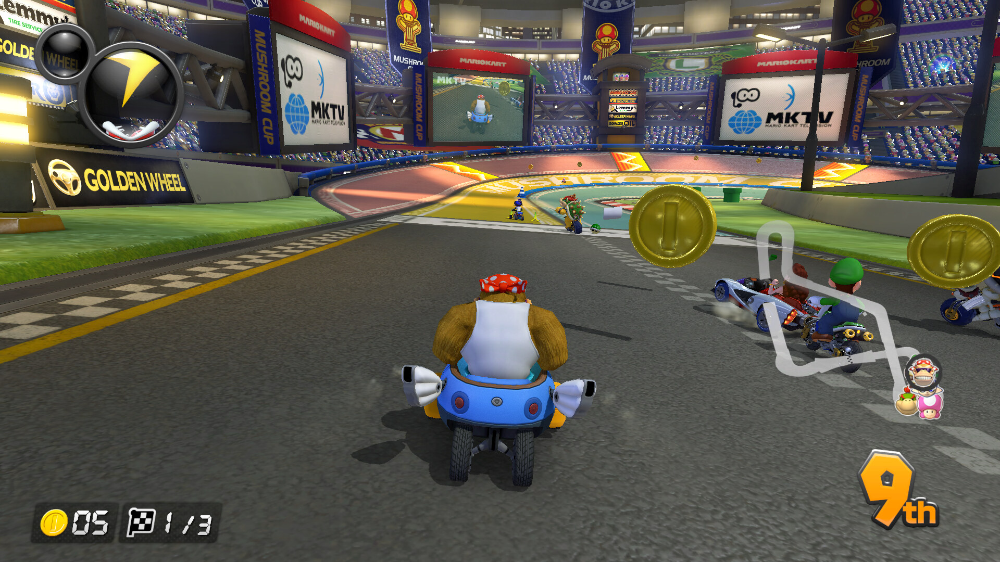
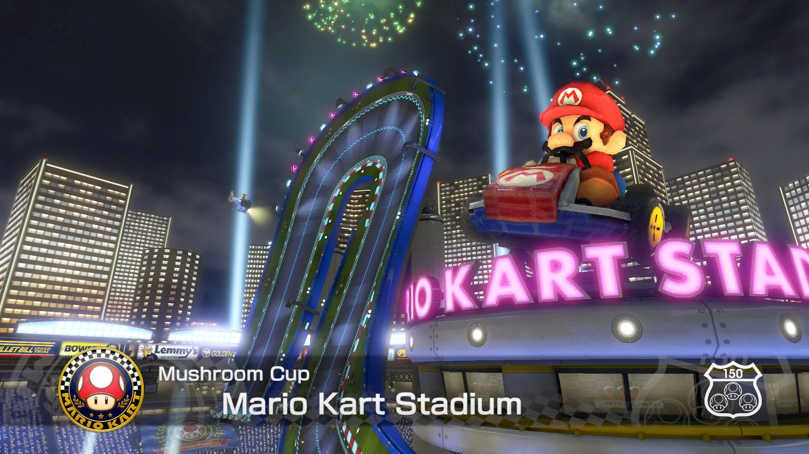
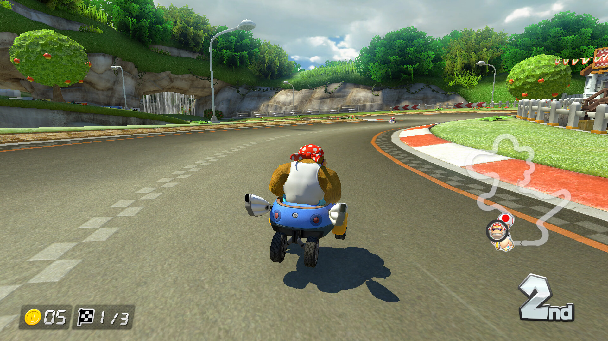
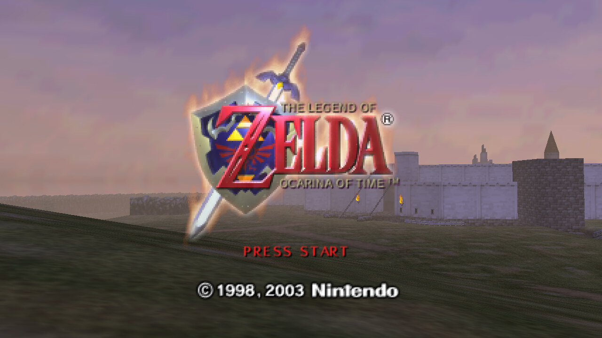
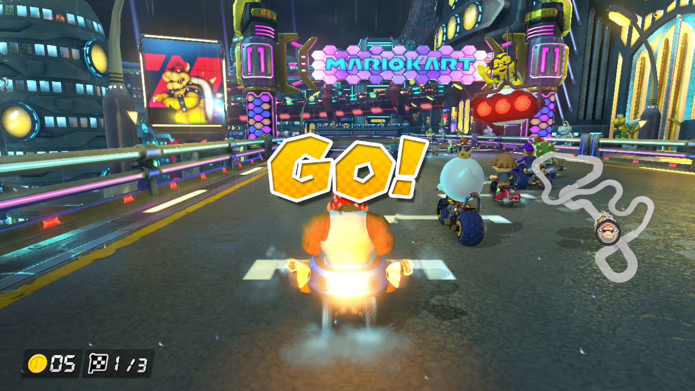
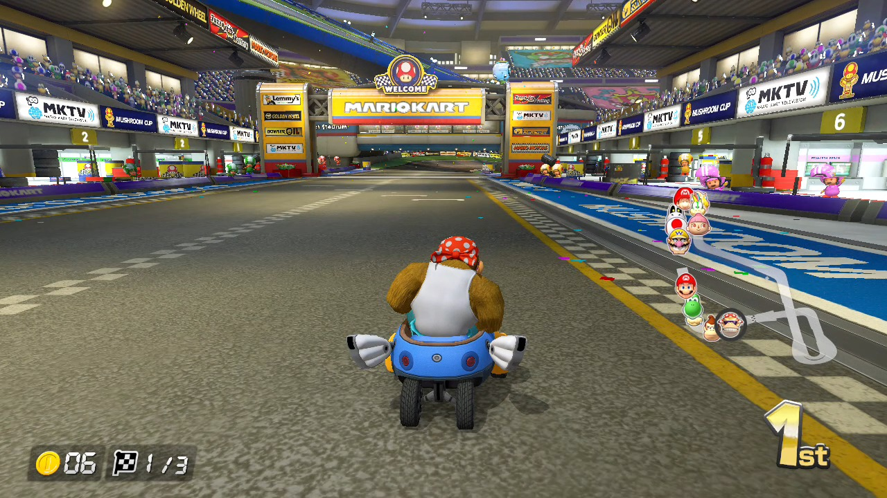

# switch-frame-tap

A Nintendo Switch sysmodule that streams the game you are playing to a PC
with no capture card, compressed with the console's own hardware H.264
encoder. Homebrew, built on and for the author's own console.

**The goal of this project is 1080p at 60 fps**: the game's native docked
resolution, at full frame rate, on any PC.

**Where it is today: 1080p60 works.** Over a plain USB cable it streams
**native 1920x1080 at the game's 60 fps** whenever the game renders 1080p, and
the console's native 1280x720 at 60 fps in ordinary handheld mode. The USB
port is only free in handheld, so 1080p over USB uses
[ReverseNX-RT](https://github.com/masagrator/ReverseNX-RT) to make the game
render its docked picture in handheld (Run W: 59.5-59.9 fps sent per 20 s
window against the game's ~59.2, 0 errors). See
[the road to 1080p60](#the-road-to-1080p60) for what is left.

> **It works, and it is playable.** Live mode streams whenever the PC viewer is
> open and a game is running, reattaches by itself when you close the viewer,
> close the game or start another one, and has been tested for several minutes
> at a time with Mario Kart 8 Deluxe (60 fps) and Zelda: Breath of the Wild
> (30 fps). Measured on the last run: **0 frames lost, 0 undecodable, 0 stale
> or torn frames in 6,965**; about **45 ms** from the game presenting a frame to
> it being on the PC screen (monitor not included).
>
> It is still **experimental**: USB only (so 1080p needs ReverseNX-RT in
> handheld), one console tested. Read
> [Limitations](#limitations) before installing it.

| | |
|---|---|
|  |  |
|  |  |

*Screenshots taken on the console with the screenshot button (L3 + R3), at
the game's own resolution: Mario Kart 8 Deluxe at 1920x1080 (docked picture
through ReverseNX-RT, in handheld), Ocarina of Time on Nintendo Switch Online
at 1280x720 - the same frames the stream sends.*



*A frame off the live stream, decoded on the PC from the console's own H.264
(Run M, live mode). [A 6.7 s clip of the stream](docs/stream-mk8-title-60fps.mp4)
is the console's bitstream exactly as it arrived over USB, only put in an MP4
container: 60 fps, keyframe every 60 frames. Below, the same clip as a small
animation.*


| | measured |
|---|---|
| Resolution / frame rate | **1920x1080** when the game renders it (docked picture via ReverseNX-RT): MK8D 58.4 fps over a session, 59.5-59.9 per window; 1280x720 native handheld: MK8D 57-59 fps, BOTW 29 fps |
| Transport | USB 2.0 bulk, the Switch's own USB-C port, no dock |
| Audio | the game's sound, 48 kHz stereo PCM, from the console's own recorder (grc:d); ~1.5 Mbps alongside the video |
| Video | H.264 from the Switch's NVENC, constant QP 20, keyframe every 60 frames; 720p ~40-55 Mbps, 1080p ~90 Mbps in a race |
| Latency | 720p: ~20-23 ms on the console (game present -> sent) + ~21-24 ms on the PC (arrival -> on screen); 1080p: ~34 + ~25 ms |
| Reliability | 0 lost / 0 undecodable frames in every run since M84; 0 stale or torn frames (M89) |
| Console | Mariko, firmware 22.5.0, Atmosphère 1.11.2 (the only one tested) |

For comparison, [SysDVR](https://github.com/exelix11/SysDVR), the established
tool, is capped at 720p30 for game video, because it reads the system's own
game-recording encoder, whose settings are fixed in firmware. This project
takes the frame before that encoder.

## How it works

```
the game presents a frame (queueBuffer)
  | vi:u mitm (games) / vi:m mitm (homebrew) sees it: which swapchain slot,
  | and the GPU fence for it
  v
take the newest frame the GPU has finished (or wait for the next one)
  v
svcReadDebugProcessMemory: copy the slot out of the game's memory
  |   (the kernel debug SVCs - the only route to another process's pixels)
  v
VIC: RGBA block-linear -> BT.709 NV12 (the Tegra's video compositor)
  v
NVENC: H.264, IDR + P frames (the job the system's own recorder builds)
  v
USB bulk -> tools/raw-recv/raw-view on the PC: libusb + libavcodec + SDL2
```

The sysmodule never touches the GPU or the display stack's buffers directly.
It watches the game's display traffic through a `vi:u` mitm (and homebrew's
through `vi:m`, for the running application only), reads the
finished frame with the same debug SVCs Atmosphère's cheat engine uses, and
drives the VIC and NVENC engines itself over raw `nvdrv` ioctls.

## What you need

**Required** - enough to stream at 720p60, take screenshots and use the
manager app:

| | |
|---|---|
| A Switch running **Atmosphère** custom firmware | [Atmosphère releases](https://github.com/Atmosphere-NX/Atmosphere/releases) - tested with 1.11.2 on firmware 22.5.0 (Mariko). New to custom firmware: the [NH Switch Guide](https://switch.hacks.guide/). Keep a NAND backup. |
| The **homebrew menu** | Comes with Atmosphère (`hbmenu.nro`); also [nx-hbmenu releases](https://github.com/switchbrew/nx-hbmenu/releases). It opens the manager app. |
| A **Windows or Linux PC** | Windows 10/11: the viewer zip, plus the WinUSB driver installed once with [Zadig](https://zadig.akeo.ie/). Linux: `libusb`, `SDL2`, `libavcodec` - one `apt install` line. Both [below](#install-v020). |
| A **USB-C cable** | USB 2.0 is plenty; the Switch stays in handheld (the dock owns the port). |

**Optional** - one per feature:

| for | install | notes |
|---|---|---|
| **The overlay** (stream on/off, "Stream this app" and handheld/docked from inside a game) | an overlay menu: [Ultrahand Overlay](https://github.com/ppkantorski/Ultrahand-Overlay/releases) (its `sdout.zip` includes the loader, nx-ovlloader), **or** [Tesla Menu](https://github.com/WerWolv/Tesla-Menu/releases) with [nx-ovlloader](https://github.com/WerWolv/nx-ovlloader/releases) | Without one, everything is still in the manager app except handheld/docked. |
| **1080p** over USB | [SaltyNX](https://github.com/masagrator/SaltyNX/releases) and [ReverseNX-RT](https://github.com/masagrator/ReverseNX-RT/releases) (tested: SaltyNX 2.0.0) | ReverseNX-RT makes the game render its docked (1080p) picture in handheld; it needs an overlay menu too. Official games only. |
| **1080p at a full 60 fps** | a clock tool: [sys-clk](https://github.com/retronx-team/sys-clk/releases) or [Horizon OC](https://github.com/Horizon-OC/Horizon-OC) | CPU 1785 MHz (Nintendo's boost clock). At the stock clock 1080p runs a little below 60. |
| **Screenshot notifications** | [Ultrahand Overlay](https://github.com/ppkantorski/Ultrahand-Overlay/releases) | Screenshots work without it; Ultrahand only shows the "Screenshot saved" toast. |

Nothing else: no other sysmodule, no sigpatches, no capture card.

## Install (v0.3.0)

This drives hardware engines directly; a bug can freeze the console (see
[If something goes wrong](#if-something-goes-wrong)).

**1. The Switch.** Download `switch-frame-tap-0.3.0-switch.zip` from the
[release](https://github.com/TomasUribe/switch-frame-tap/releases) and unzip
it onto the root of the SD card (card reader or Hekate USB mass storage). It
contains:

```
atmosphere/contents/0100000000000C20/        the sysmodule (starts at boot)
switch/switch-frame-tap/switch-frame-tap.nro  the manager app (homebrew menu)
switch/.overlays/switch-frame-tap.ovl         the overlay (Tesla / Ultrahand)
```

Reboot. Updating later is the same: unzip over it; your settings are kept.

**2a. The PC viewer on Windows.** Unzip
`switch-frame-tap-0.3.0-windows-viewer.zip` anywhere. Once, with the Switch
connected and running: open [Zadig](https://zadig.akeo.ie/), **Options ->
List All Devices**, pick **Switch Frame Tap** (USB ID 1209 5F1E - make sure
it is that one), choose **WinUSB** and **Install Driver**. Then double-click
`SwitchFrameTap.exe` (keep the DLLs next to it). Windows may warn about an
unknown publisher: **More info -> Run anyway**.

**2b. The PC viewer on Linux.** Install the build dependencies and the udev
rule (lets the viewer open the Switch without sudo), then the desktop app:

```bash
sudo apt install build-essential libusb-1.0-0-dev libsdl2-dev libavcodec-dev libavutil-dev
sudo cp tools/raw-recv/99-switch-frame-tap.rules /etc/udev/rules.d/
sudo udevadm control --reload-rules && sudo udevadm trigger
bash tools/raw-recv/install-launcher.sh
```

That puts a double-clickable **Switch Frame Tap** on the desktop and in the
applications menu. The release also has
`switch-frame-tap-0.3.0-linux-viewer.tar.gz` with the same files.

On both, the viewer opens a window, waits for the Switch, reconnects on its
own and closes only when you close it (F11 or a double-click: fullscreen). It
plays the game's sound on the default audio device (**M** mutes).
It reads USB, decodes and draws on separate threads and shows the frames in
order, one per screen refresh (vsync), so the picture stays smooth. Its
statistics - frame rate, latencies, decode and draw times, once a second - go
to the terminal on Linux and to `%APPDATA%\switch-frame-tap\viewer\viewer.log`
on Windows.

**3. Stream.** Connect the Switch (handheld) to the PC with the USB-C cable,
open the viewer and start a game. The picture appears a few seconds after the
game is on screen (at the earliest 20 s after boot). Close the viewer or the
game whenever you like; the stream picks up again when both are back.

**1080p.** Install [SaltyNX and ReverseNX-RT](https://github.com/masagrator/ReverseNX-RT)
and pick **Docked (1080p)** in the Switch Frame Tap overlay (or ReverseNX-RT's
own): the game renders its docked picture and the stream switches to
1920x1080 by itself. 1080p60 wants **CPU 1785 MHz** (Nintendo's own boost
clock; GPU 768 / RAM 1600, the docked values) from a clock tool such as
Horizon OC or sys-clk; at the stock 1020 MHz it runs, a little below 60.
Expect more heat and battery drain, and some games dislike fake docked mode
(MK8D crashes with Joy-Cons attached; use a Pro Controller).

### The manager app

**Switch Frame Tap** in the homebrew menu: what the stream is doing (and its
frame rate), streaming on/off, start with the console, picture quality
(High/Medium/Low), keyframe interval, maximum resolution (1080p/720p), game
audio on/off, start delay, screenshots, and a setup check (sysmodule, overlay, overlay loader,
SaltyNX, ReverseNX-RT). Changes apply at once - a running stream restarts with
them. Settings live in `sdmc:/config/switch-frame-tap/config.ini`.

### The overlay

Needs an overlay menu (Tesla Menu or Ultrahand, on nx-ovlloader): stream
on/off (remembered across reboots), live status, **Stream this app** (see
below), and Game default / Handheld (720p) / Docked (1080p) through
ReverseNX-RT.

### Homebrew

Homebrew apps stream too - forwarders on the HOME menu, and the homebrew menu
in title-override mode - at the resolution the app draws (usually 1280x720).
ReverseNX-RT cannot switch homebrew to docked mode (it works through the
official SDK, which homebrew does not use), and most homebrew draws 720p in
both modes anyway. Some apps refuse to run while a debugger is attached - the
stream reads frames that way - such as TiCo's protected builds: turn **Stream
this app** off in the overlay while one is running and restart it; the
sysmodule then never touches it (no stream, no screenshots). The manager's
**Apps never streamed** clears the list.

### Screenshots

Turn on **Screenshot button** in the manager and press **L3 + R3** (or another
combo you pick there) in any game: the frame is saved as a PNG at the game's
own resolution - 1920x1080 docked or with ReverseNX-RT, 1280x720 handheld -
in `sdmc:/switch/switch-frame-tap/screenshots/`, with or without the PC
viewer (~0.4 s). With Ultrahand installed a notification confirms it. Browse,
view and delete them in the manager (**View screenshots**). The PNGs are
stored uncompressed: exactly the pixels the game drew, ~6 MB at 1080p.

### Logs

`sdmc:/config/switch-frame-tap/log.txt` (rewritten at every boot, capped at
4 MB) and `last.txt`, a one-line breadcrumb that survives a forced power-off.
Please attach both to a bug report.

## Building from source

```bash
git clone --recursive https://github.com/Atmosphere-NX/Atmosphere ref/Atmosphere
git clone https://github.com/WerWolv/libtesla ref/libtesla
bash tools/make_release.sh 0.3.0       # -> dist/switch-frame-tap-0.3.0-{switch.zip,linux-viewer.tar.gz,windows-viewer.zip}
bash tools/run_pc_tests.sh             # every check that needs no console
```

Everything builds in the `devkitpro/devkita64` Docker image (the first build
compiles libstratosphere, ~15 minutes). The PC viewer: `make -C tools/raw-recv`;
the Windows viewer is cross-compiled from Linux with Zig -
`bash tools/raw-recv/build-windows.sh VERSION`, toolchain listed in
[`ref/README.md`](ref/README.md). `raw-view --file REC.sft --paced` runs a
recording through the live pipeline (no console needed).

**Test installs.** With `sdmc:/applet-mitm.armed` on the card the sysmodule
ignores `config.ini` and reads its flags from that file instead
(`vic exec dbg usb nvgop=60 live wait=20` is the release behaviour), logging
to `sdmc:/applet-mitm.log` - how every development run was done.

## Limitations

- **Handheld only.** It streams through the Switch's USB-C port in device mode,
  and docked, the dock owns that port. 1080p works in handheld through
  ReverseNX-RT; streaming from the dock needs a network transport (not started).
- **1080p60 wants CPU 1785 MHz.** The frame copy runs on the CPU; at the stock
  1020 MHz it is slower and 1080p runs a little below 60 (still playable).
- **Homebrew:** apps that run as applets (the homebrew menu from the album)
  are not streamed - use a forwarder or title override. Apps with anti-debug
  protection (TiCo) cannot be streamed; exclude them. Homebrew cannot be
  forced into docked mode.
- **Two games tested:** Mario Kart 8 Deluxe (three 1920x1080 buffers) and
  Zelda: Breath of the Wild (two). Other games should work if their swapchain
  is block-linear RGBA, at most 1920x1080, in one memory object; the log says
  so if not. Colours are verified for the A8B8G8R8 format those two use.
- **Game audio** comes from the console's own video recorder (as with SysDVR):
  games that turn video capture off have no sound in the stream.
- **PC viewer: Windows and Linux** (x86_64). No macOS viewer yet. On Windows
  the driver needs Zadig once, as with SysDVR.
- **It debug-attaches to the running game.** A process can have one debugger,
  so expect Atmosphère's cheat engine (dmnt) and similar tools not to work on
  a game while it is being streamed.
- **Occasional micro-stutters** during loading and heavy scenes: reads,
  the VIC and NVENC are shared with the whole system (NVENC also with the
  console's own background recording), and a frame can take 50-200 ms then.
- **Bitrate is not tuned.** P frames are about 60% of a keyframe in a fast
  race at QP 20; ~40-55 Mbps fits USB 2.0 (~290 Mbps) easily but is more than
  it needs to be.
- **One console tested.** Mariko, firmware 22.5.0, Atmosphère 1.11.2.

## If something goes wrong

Turn off **Start with the console** in the manager and reboot; or delete
`atmosphere/contents/0100000000000C20/` from the SD card on a PC; or boot
holding **Volume Up**, which makes Atmosphère skip `contents` sysmodules.
Nothing here touches NAND or the bootloader. Keep a NAND backup anyway.

Read the SD card through a card reader or Hekate's USB mass storage, **not
MTP**: MTP returns I/O errors on a log whose tail was cut by a forced
power-off. Copy the log off before the console boots Atmosphère again.

## How this was built — with an AI, openly

I built this together with **Claude** (Anthropic's AI model, through Claude
Code). That should change how you read and trust what's here.

- **Claude** wrote nearly all of the code and the documentation, did the
  source-reading (Atmosphère and its kernel mesosphere, NVIDIA's open headers,
  switchbrew, reference drivers), designed each hardware probe, and
  interpreted the logs that came back.
- **I** set the goal and the direction, ran every one of the 87 hardware test
  cycles on my own console, read the logs back off the SD card, decided which
  routes to keep pushing and when to drop one, and decided what to publish.

What that means for you:

- **"Verified on hardware" means exactly that**: a real run on a real console,
  with the log, committed under [`logs/`](logs). Conclusions drawn from reading
  source rather than running it are labelled as such.
- **The AI got things wrong, and some mistakes were not cheap**: bugs that froze
  the console, one that fataled another sysmodule at boot, a timing figure
  (a "119 ms" VIC blit that was really SD-card logging) published before it
  was checked, and an early NVENC result over-read. Every one is recorded in
  [`tier4/mitm/STATUS.md`](tier4/mitm/STATUS.md), corrections left in place.
- **The history shows it.** Most commits carry a `Co-Authored-By: Claude`
  trailer.

Review it as you would a contribution from someone you haven't worked with
before, which is good advice for homebrew that drives hardware engines anyway.

---

## The research

The full log, newest first, with every dead end and its evidence, is
[`tier4/mitm/STATUS.md`](tier4/mitm/STATUS.md). The map for picking the
project up is [`tier4/mitm/PROJECT-HANDOFF.md`](tier4/mitm/PROJECT-HANDOFF.md);
the early narrative is [`tier4/mitm/WRITEUP.md`](tier4/mitm/WRITEUP.md). The
highlights:

### Getting the pixels: three routes closed, one open

A sysmodule can process frames at full speed; getting hold of one is the
problem. Three routes through the graphics stack were each taken to a definite
verdict:

| route | verdict |
|---|---|
| Import the game's swapchain `nvmap` handle (`FROM_ID` + `MAP_CMD_BUFFER`) | Pins to `phys=0`, silently, whatever the flags, permission mask or aruid. **Structural:** nvservices maps client memory through the handle of the process that initialised it, and the game's pages are in the game's process. |
| `vi` indirect layers (`GetIndirectLayerImageMap`) | `0x60A`. The object graph builds and the layer stays empty: attaching an application's layer to an indirect layer is AM's job. |
| Read back the display controller | No such ioctl in nvdrv. |

The route that works goes around the graphics stack: `svcDebugActiveProcess`
+ `svcReadDebugProcessMemory`, with `"force_debug": true` in the NPDM (as
`creport` and `dmnt.gen2` declare). mesosphere's permission check ignores the
`DeviceShared` attribute that sank the nvmap route (`kern_k_page_table_base.cpp`),
and a whole 1080p slot reads in ~5 ms. Two things are needed to stay attached
without hurting the game:

- **A debug event pump.** While attached, every thread start or exit in the
  game suspends *all* its threads until the debugger continues
  (`KDebugBase::ProcessDebugEvent`). Loading screens start threads; the first
  stream froze on one. `applet_mitm_dbgpump.cpp` does what dmnt's cheat engine
  does: block on the debug handle, drain, continue - on the new thread's core.
- **Never hold the game's graphics resources.** Importing the game's buffer
  handle or adopting its aruid in our nvdrv session kept an exited game's
  memory alive, and the next launch hung on a black screen. Live mode uses
  only its own buffers.

### Reading a finished frame

The mitm sees `queueBuffer` when the game *submits* a frame, and the GPU is
often still drawing it: queueBuffer carries an acquire fence, which the
compositor waits on. Reading early produced torn frames and whole frames from
two or three presents back. The capture now snapshots the slot and its fence
together (a seqlock against the binder thread), waits for the fence (measured:
5.5 ms average in MK8D, 7.5-11 ms in BOTW), then reads. `tools/sft_tool.py
artifacts` counts both artifacts in a recording: 29 stale / 22 torn per 3000
frames before, 0 / 0 after.

### Driving the Tegra engines from a sysmodule

- **VIC** over raw nvdrv, byte-exact: `SETCL` is mandatory (nvservices, unlike
  the Linux DRM driver, does not set the class), relocs are inert on Horizon
  (pin with `MAP_CMD_BUFFER` and inline the address), the syncpoint increment
  must be in the command stream, and a zero address hangs the VIC and with it
  the compositor.
- **The VIC's colour matrix, solved.** Three attempts produced a flat picture;
  an 11-probe sweep gave an exact law (`out = sum(K * in) * 2^-(8 + shift) +
  offset`, [`tools/vic_csc.py`](tools/vic_csc.py)) that reproduces all 528
  measured values. The stream uses real BT.709 limited range.
- **Block-height units differ:** the VIC's is log2 of GOBs; NVENC's
  `block_height` value 2 means 16 rows. Mismatched, the encode came out
  perfectly scrambled.
- **NVENC was never "unbooted firmware" - it was unclocked.** On Horizon a
  client requests the engine's clock from `mm:u` before using it (as averne's
  FFmpeg nvtegra code does); an unclocked engine accepts a job and never runs
  it. With the clock up, the job the system's own recorder (grc) builds,
  captured from grc and replayed from our own channel, encodes correctly;
  constant QP works through RCMODE 0; `error_status` 2 is routine (grc's own
  frames carry it). P frames use grc's P setup and job with the references
  ping-ponging; the drift test (last frame of a 59-P-frame chain against the
  console's own picture) passes at 42 dB.



*The last frame of a 30-frame IDR + P chain encoded on the console (Run K),
decoded on the PC: 42 dB against the console's own picture of it.*

### The transport

USB 2.0 bulk through `usb:ds` saturates at ~37 MB/s from this module (measured
across five resolutions), which is why raw pixels stopped at 768x432 and the
stream is H.264. Transfers that time out are cancelled, so a newly opened
viewer never starts mid-frame. SuperSpeed descriptors (including the BOS
`usbDsSetBinaryObjectStore` needs) are accepted but the link still trains to
High Speed on the cable tested.

### Pieces you might want on their own

- **Non-domain mitm sub-object forwarding for libstratosphere**
  ([`tier4/applet-mitm/patch_libstrat.py`](tier4/applet-mitm/patch_libstrat.py),
  55 lines): Atmosphère's mitm framework forwards undeclared commands only on
  domain sessions; `vi:u` hands out its sub-objects on non-domain ones. If you
  have tried to mitm `vi` and given up, this is the missing piece.
- **A transparent `vi:u` mitm** that recovers every frame's layout from the
  binder traffic (`setPreallocatedBuffer`, `queueBuffer` with its fence), and
  handles both `GetDisplayService` and `GetDisplayServiceWithProxyNameExchange`
  (command 1, used by BOTW: its request is forwarded byte for byte).
- **Undocumented `vi` ABIs:** `CreateIndirectLayer` (2050),
  `CreateIndirectProducerEndPoint` (2052), `CreateIndirectConsumerEndPoint`
  (2054), all `{u64, u64} -> u64`; `GetDisplayService`'s command id is the
  service type (`vi:u` 0, `vi:s` 1, `vi:m` 2).
- **A dmnt-style debug event pump** for any sysmodule that stays attached to a
  game.
- **PC tools with self-tests** (`bash tools/run_pc_tests.sh`): the viewer,
  `sft_tool.py` (recording stats, drift test, artifact detector), the VIC matrix
  model, NVENC setup decoders.

Earlier captures, kept for the record: the game's swapchain read out at native
1080p and de-swizzled on the PC ([`docs/frame-1080p.png`](docs/frame-1080p.png)),
and the raw 768x432 "packed 4:2:0" stream that preceded H.264
([`docs/frame-stream-packed420.png`](docs/frame-stream-packed420.png)).

## The road to 1080p60

The goal is the game's native docked output, **1920x1080 at 60 fps**, streamed
to a PC. **Reached over USB (M96, Run W):** 58.4 fps over a session against the
game's 59.2, 59.5-59.9 fps per 20 s window once running, 0 lost or undecodable
frames in 9,090. How it got there:

1. **A 1080p NVENC setup** (M90-M92). The system's own recorder only builds
   720p jobs, so the 1080p setup was derived from grc's 720p one
   (`tools/nvenc_replay.py`). 1920x1080 stalls the engine; **1920x1088** (whole
   macroblock rows) encodes, and the SPS crops the picture to 1080.
2. **1080p over USB** (M93). ReverseNX-RT makes the game render its docked
   picture in handheld, where the USB port is free; the stream detects the size
   change and restarts at 1080p by itself.
3. **The frame budget** (M94-M96). A 1080p frame is an 8.3 MB copy out of the
   game (~8.5 ms at CPU 1785 MHz), a 1.7 ms VIC conversion and a 5.6 ms encode.
   The encode now runs while the next frame is read (M94), and the capture
   takes the newest frame the GPU has *finished* instead of the newest one
   queued (M96: waiting on the latest queued frame skipped 20% of frames; now
   1.6%).

What is left: **stock clocks** (1080p60 at CPU 1020 MHz), and a **network
transport** for streaming from the dock, where the dock owns the USB port
(1080p60 at ~90 Mbps needs a LAN adapter or bitrate tuning for Wi-Fi).

## Roadmap

| stage | state |
|---|---|
| Capture the game's frames (`vi:u` mitm + debug SVCs) | **done, on hardware** |
| VIC conversion to BT.709 NV12 | **done, on hardware** |
| NVENC H.264, IDR + P frames | **done, on hardware**; no drift over 59-frame chains |
| USB transport + live PC viewer with latency readout | **done, on hardware** |
| Live mode: viewer and game come and go | **done, on hardware** (M86-M86b) |
| Games beyond MK8D (per-game swapchain geometry, `vi:u` command 1) | **done for BOTW** (M87); others untested |
| Frame-exact capture (GPU fence, slot+fence snapshot) | **done, on hardware** (M88-M89): 0 stale, 0 torn |
| **1080p60 over USB** (1920x1088 NVENC setup, pipelined encode, finished-frame capture) | **done, on hardware** (M90-M96): 58.4 fps sent vs the game's 59.2, with ReverseNX-RT in handheld and CPU 1785 MHz |
| 1080p60 at stock clocks (CPU 1020 MHz) | tested (Run X): works, a little below 60 |
| **Releases**: v0.1.0 (config file, manager app, overlay, native screenshots); v0.1.1 (homebrew) | **done, on hardware** (M97-v0.1.1) |
| Homebrew apps (forwarders and title override: a `vi:m` mitm for the running application only; larger and offset swapchains, BGRA, 1080p for any layout; a never-attach list) | **done, on hardware** (v0.1.1) |
| Bitrate tuning (better P frames, QP) | next; also lowers what 1080p60 needs from the network |
| 1080p60 from the dock, over the network | not started: needs a network transport, see [above](#the-road-to-1080p60) |
| Game audio (grc:d PCM alongside the video; paced playback) | **done** (v0.3.0) |
| Windows viewer, and paced display (reader / decoder / vsync threads) on both | **done** (v0.2.0) |
| USB 3.0 lossless (handheld) | parked: the link still trains to High Speed |
| Home menu and system overlays | not possible through any route found |

## Layout

| path | what |
|---|---|
| `tier4/applet-mitm/` | The sysmodule: `vi:u` mitm, binder intercept, debug-SVC capture and event pump, VIC and NVENC over raw nvdrv, USB. |
| `tools/raw-recv/` | `raw-view`, the PC viewer, and `install-launcher.sh`, its desktop app (and `raw-recv`, the raw-frame receiver it grew out of). |
| `manager/` | The manager app for the homebrew menu (SDL2): settings, status, setup check, screenshot gallery. |
| `overlay/` | The Tesla/Ultrahand overlay: stream on/off, status, handheld/docked through ReverseNX-RT. |
| `tools/` | `make_release.sh` (the release zip), and PC-side analysis and self-tests: `sft_tool.py`, `nvframe_check.py`, `nvp_check.py`, `vic_csc.py`, `nvenc_replay.py`, `nvrec.py`. |
| `tier4/mitm/` | `STATUS.md` (the research log), `PROJECT-HANDOFF.md` (the map), `WRITEUP.md`. |
| `logs/` | The hardware runs' logs and checked outputs. |
| `docs/` | Images and the stream clip. |
| `tier4/recon/`, `tier4/stream-oc/`, `switch-stream/` | Early side projects: a diagnostic sysmodule, an overclock companion, a first streamer attempt. Historical. |
| `ref/` | Not committed: third-party reference trees, see [`ref/README.md`](ref/README.md). |

## Contact

Questions, corrections, or if you want to take a piece of this further - I'd
genuinely like to hear about it.

- **Email:** Some_Potato_1@protonmail.com
- **Reddit:** [u/Papux200](https://www.reddit.com/user/Papux200)
- **Issues:** [GitHub issues](https://github.com/TomasUribe/switch-frame-tap/issues)

Forks are welcome and no permission is needed.

## License

GPL-2.0. `tier4/applet-mitm` links libstratosphere and ships a patch against
it, so it is a derivative of Atmosphère and could not be anything else. See
[LICENSE](LICENSE) and [NOTICE](NOTICE).
